# resume-generator — control flow and suggested changes

Traced from `skills/resume-generator/` at v0.3.0 (`SKILL.md`, `onboarding.md`, `generation.md`, `deep-dive.md`, `variants.md`, `cover-letter.md`, `tests/*.sh`). The DOT graph in `SKILL.md` stays the source of truth for the entry gate; this document is a derived explainer plus a set of proposals. **Status (2026-09-03): the Part 3 suggestions S1-S7 are implemented in v0.4.0. Part 1 documents the v0.3.0 flow they replaced; Part 4 is the flow that now ships.**

Every diagram starts with `%%{init: {"theme": "dark"}}%%` so it renders readably on a dark editor background regardless of the preview extension's theme setting. On a light theme, delete that line from each block (or set `markdown-mermaid.lightModeTheme` / `darkModeTheme` in VS Code and drop the directives).

Diagram legend (all `flowchart` diagrams):

| Shape | Meaning |
|---|---|
| `[[ ... ]]` | a bash script under `tests/` or a dispatched sub-agent (labelled) |
| `{ ... }` | a decision taken in main context |
| `[( ... )]` | a file written or read |
| `([ ... ])` | entry / exit of a doc |
| dotted edge | control returns through the gate |

---

## Part 1 — Current flow

### 1.1 Bird's-eye

Control moves between markdown docs. Each doc is loaded only when the previous one says so, which keeps the per-run context small.

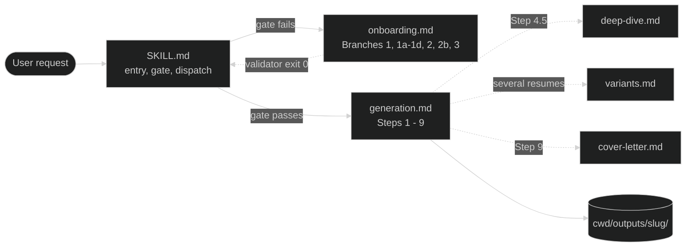

### 1.2 Entry and gate (`SKILL.md`)

The gate is `tests/validate-knowledge.sh`, never an eyeball check. Its exit code selects the onboarding branch. A job posting given as URL or file goes to a haiku sub-agent so raw page content never enters main context; pasted text is analysed inline.

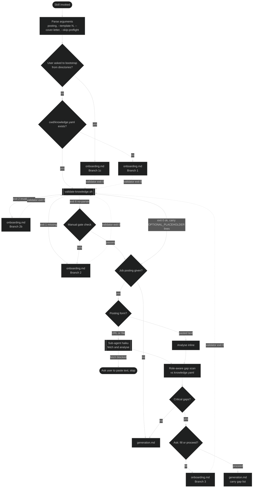

Two paths bypass nothing: "I'm in a hurry, invent placeholders" is answered with the 60-second path (Branch 1a plus five facts) or import, never with a fabricated `resume.tex`.

### 1.3 Onboarding (`onboarding.md`)

Branches 1a, 1b and 1c end the turn after one validator run; the user re-invokes. Branches 2, 2b and 3 loop on the validator until exit 0 and then hand control back to `SKILL.md`.

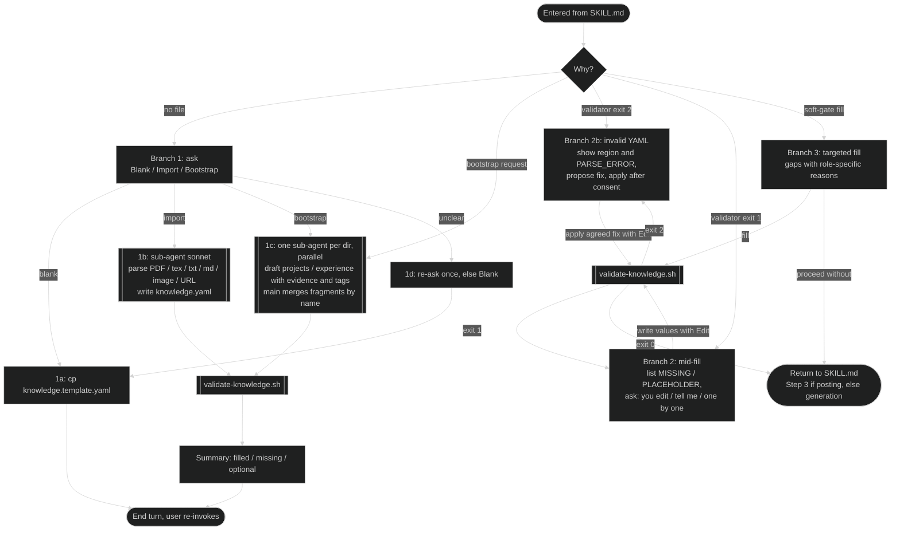

### 1.4 Generation (`generation.md`, Steps 1 - 9)

One resume per run. Three repair loops exist, all operating on `resume.tex`: lint (max three rounds), compile failure (one retry via a sonnet sub-agent), and the QA gate (one trim cycle).

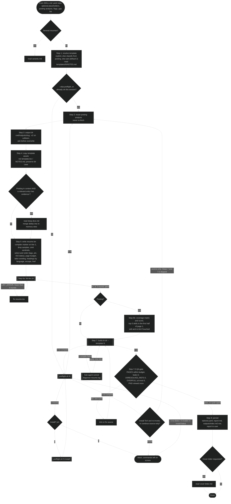

### 1.5 Deep-dive (`deep-dive.md`, Step 4.5)

Runs only with a posting in context. One sonnet sub-agent per selected entry, all dispatched in one message. Output is a JSON delta merged into the in-memory view; `knowledge.yaml` is never written.

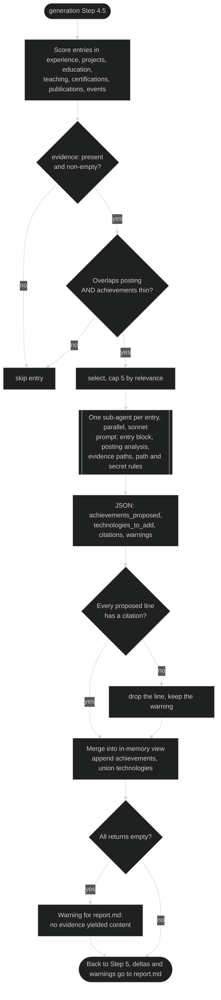

### 1.6 Variants (`variants.md`)

Every user-facing decision is resolved in main before fan-out because sub-agents cannot ask. Each variant sub-agent runs Steps 4 - 8 in its own output dir, including its own deep-dive. Main is the only writer of `outputs/index.md`.

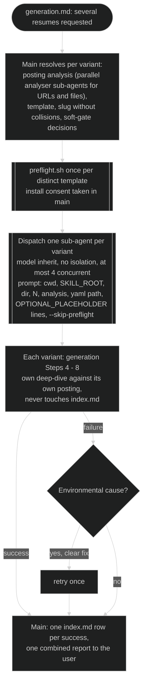

### 1.7 Cover letter (`cover-letter.md`, Step 9)

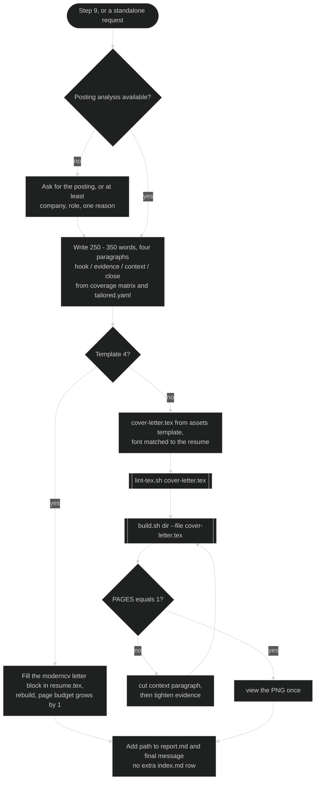

### 1.8 Who talks to whom

Sub-agents are dispatched only when they keep raw content out of main: fetched pages, parsed source documents, directory walks, verbose logs, parallel builds. Everything that needs the user stays in main.

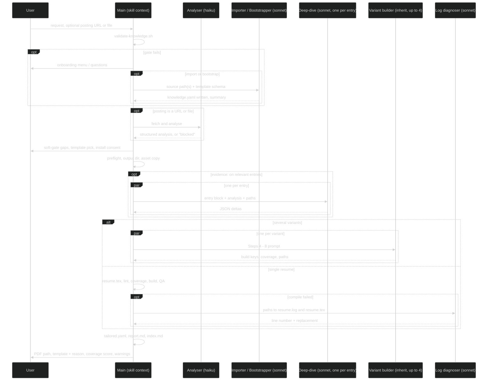

### 1.9 Files: what reads and writes what

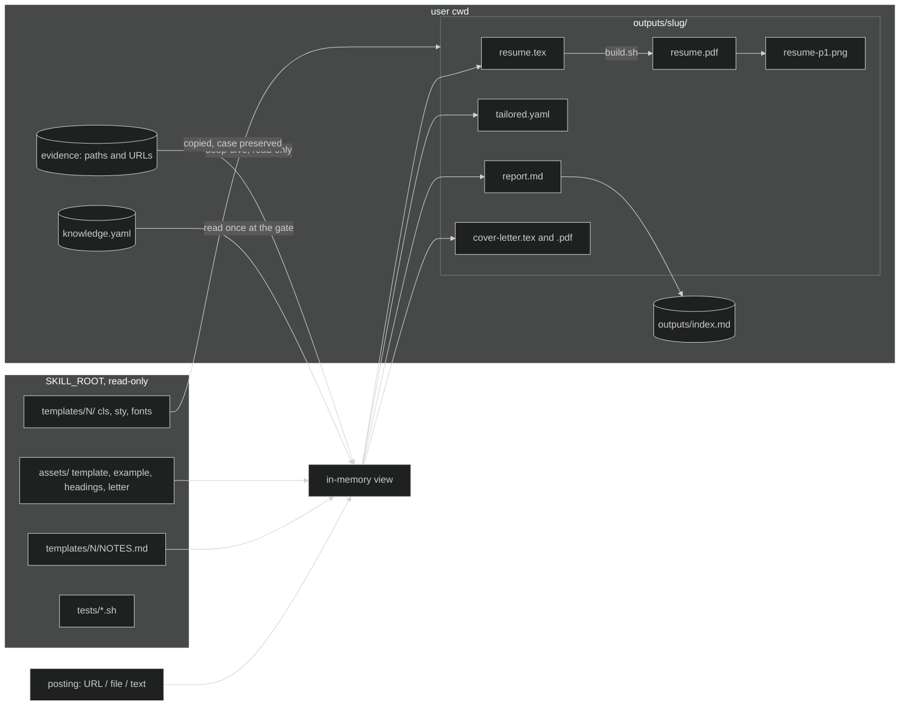

### 1.10 Step ownership

| Stage | Doc | Script | Sub-agent |
|---|---|---|---|
| Argument parse, bootstrap intercept | SKILL.md | - | - |
| Hard gate | SKILL.md | `validate-knowledge.sh` | - |
| Posting analysis | SKILL.md Step 3 | - | haiku (URL / file only) |
| Soft gate | SKILL.md Step 3 | - | - |
| Onboarding writes | onboarding.md | `validate-knowledge.sh` after every write | sonnet (import, bootstrap) |
| Template resolve | generation.md Step 1 | - | - |
| Preflight | generation.md Step 1.5 | `preflight.sh` | - |
| Output dir, assets | generation.md Steps 3 - 4 | - | - |
| Deep-dive | deep-dive.md | - | sonnet, one per entry, cap 5 |
| Render `resume.tex` | generation.md Step 5 | - | - |
| Lint, coverage | generation.md Step 6 | `lint-tex.sh` | - |
| Build | generation.md Step 7 | `build.sh` | sonnet (log diagnosis) |
| QA gate | generation.md Step 7.5 | reads `build.sh` keys | - |
| Persist, report | generation.md Step 8 | - | - |
| Variants | variants.md | `preflight.sh` per template | inherit, one per variant |
| Cover letter | cover-letter.md | `lint-tex.sh`, `build.sh --file` | - |

---

## Part 2 — Friction points found while tracing

1. **The compiler check comes late.** `preflight.sh` needs a template number, so it runs at Step 1.5, after the gate, the posting fetch, the soft-gate question and the template pick. A user without TeX answers several questions before learning they must install or go source-only.
2. **Three repair loops all edit LaTeX.** Lint, compile failure and page-budget trimming each patch `resume.tex`, the hardest representation to change safely. `tailored.yaml` is dumped afterwards, so it can disagree with what hand-trimming actually removed.
3. **Coverage is measured after rendering.** The coverage matrix is built in Step 6b from a finished `resume.tex`, so a missing top-3 skill means another LaTeX edit and re-lint instead of a selection decision.
4. **Deep-dive re-reads the same evidence every run.** The sub-agent prompt mixes extraction with posting-specific phrasing, so nothing is reusable across postings, regenerations or variants. Variants dispatch their own deep-dives per posting.
5. **The posting analysis is not persisted structurally.** Only prose in `report.md`. "Redo the Stripe one after my edits" or "now a cover letter for that one" re-fetches (often blocked) or re-derives.
6. **The QA gate is applied by the model, not a script.** The repo's own rule is "the gate is the script"; that holds for the knowledge gate and lint, but Step 7.5's thresholds and the page-budget arithmetic are model-applied.
7. **The soft gate asks before the deep-dive can answer.** Gaps such as "SQL missing from skills" or "only one ML project" are often exactly what `evidence:` would surface a few steps later.
8. **Onboarding sources are exclusive.** Blank / Import / Bootstrap is a three-way choice; users with a resume PDF and work dirs need two turns.

---

## Part 3 — Suggestions

Each suggestion is self-contained. Diagrams show the changed portion only; unchanged steps are collapsed.

### S1 — Probe the environment at entry, not at Step 1.5

**Problem.** Friction point 1.

**Change.** Add a template-agnostic `tests/env-probe.sh` (or `preflight.sh --quick`) that reports `PDFLATEX=`, `XELATEX=`, `LATEXMK=`, `PDFTOTEXT=`, `PYYAML=` in under a second. Run it in `SKILL.md` alongside the file check. If no compiler is present, ask the install-vs-source-only question first, before any other question. Step 1.5 keeps the smoke compile (it needs `N`) but skips the PATH checks already done. The probe also predicts validator exit 6.

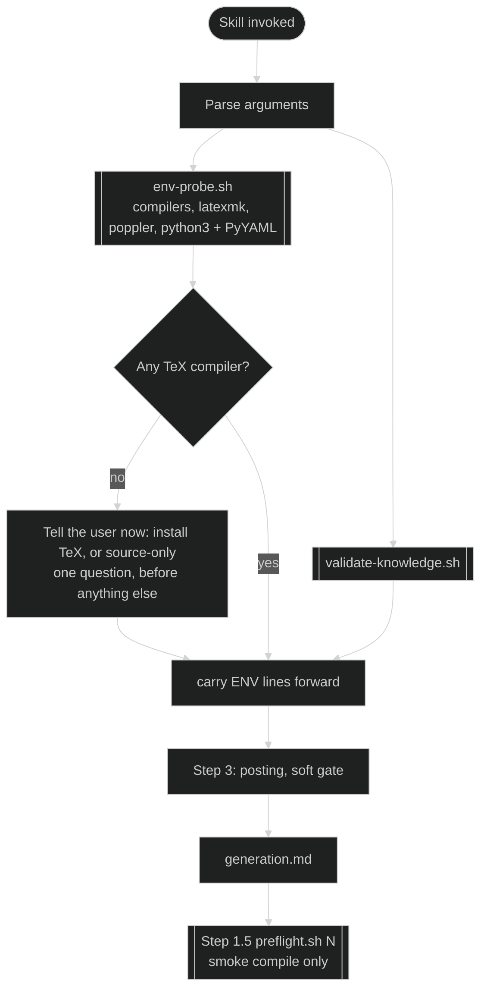

**Touches.** `SKILL.md` Steps 1 - 2, `generation.md` Step 1.5, new script + `run-tests.sh` cases, the script table in `CLAUDE.md` and `SKILL.md`.
**Risk.** Low. One extra process at entry.

### S2 — Plan, then render: `tailored.yaml` before `resume.tex`

**Problem.** Friction points 2 and 3.

**Change.** Split Step 5 into a plan and a render. 5a builds the plan: a relevance score per entry (tags, technologies, text overlap, `pin`, recency), a keep / cut / order decision with a one-line reason, a length estimate against the page budget, and the coverage matrix computed from plan × posting. The "top-3 requirements visible on the upper half of page 1" rule becomes a plan constraint. The plan is written as `tailored.yaml` immediately. 5b renders `resume.tex` mechanically from the plan (escaping, `\href`, headings). The page-budget trim loop then drops the next lowest-scored item in the plan and re-renders, instead of editing LaTeX. `report.md` reads the plan for "what was dropped and why".

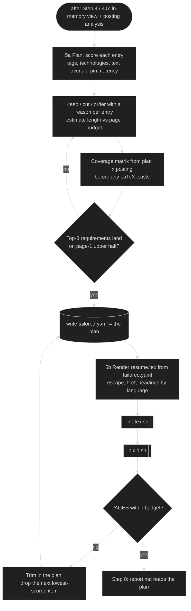

**Touches.** `generation.md` Step 5 (split), 6b (moves before render, re-verified after), 7.5 (trim targets the plan), 8 (`tailored.yaml` already written; add the score and reason fields). No script changes.
**Risk.** Slightly more tokens per run (plan written, then LaTeX). Offsets the LaTeX repair loops it removes and makes `tailored.yaml` honest.

### S3 — Cache evidence facts; tailor inline

**Problem.** Friction point 4.

**Change.** Split the deep-dive sub-agent's job in two. The sub-agent extracts **posting-agnostic facts** for an entry: quantified outcomes, technologies, scope, each with a citation. Main caches them in `<cwd>/.resume-cache/evidence/<entry-slug>.json` together with fingerprints (path + mtime or URL + fetch date) of the evidence read. Posting-specific phrasing happens inline in main from the compact facts. A cache hit with matching fingerprints skips the dispatch. Variants extract once in main before fan-out and pass the cache path, so variant sub-agents never dispatch their own deep-dives. The cache is gitignored, lives in the user's cwd, and is the only write outside `outputs/`; a later "promote these facts into knowledge.yaml" request routes through onboarding, the one sanctioned writer.

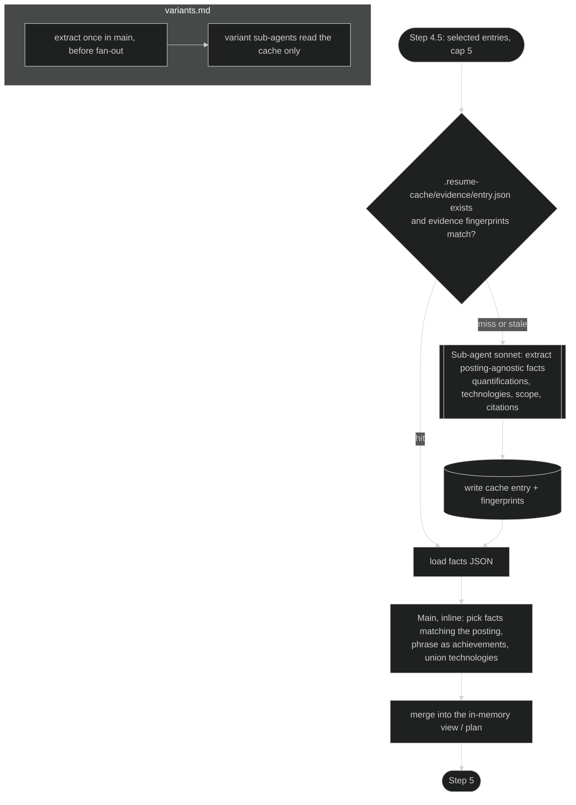

**Touches.** `deep-dive.md` (two phases, JSON shape gains `facts` and `fingerprints`), `variants.md` (extraction before dispatch), `generation.md` Step 8 (report cache hits and misses), `SKILL.md` critical rules (name the cache as the one permitted write), onboarding note on `.gitignore`.
**Risk.** Stale-cache bugs if fingerprints are weak; use mtime + size for files, fetch date for URLs, and a `--no-cache` escape hatch.

### S4 — Persist `posting.json`; add refresh, rebuild and cover-letter-later modes

**Problem.** Friction point 5. Hand edits to `resume.tex` are also never re-checked.

**Change.** Step 8 writes `<dir>/posting.json`: the structured analysis, the source (URL / file / "pasted"), the fetch date and the classification. `SKILL.md` gains three modes beyond generate. **refresh `<slug>`** re-reads `knowledge.yaml`, reuses `posting.json` and the plan, asks the existing overwrite-or-`-v2` question, and runs Steps 4.5 - 8 without re-fetching or re-asking the template. **rebuild `<slug>`** runs only lint, build and QA on the user's edited `resume.tex`, then refreshes the QA block in `report.md` and the `index.md` row. **cover letter for `<slug>`** resolves `<dir>` from `index.md` and reads `posting.json` plus `tailored.yaml`.

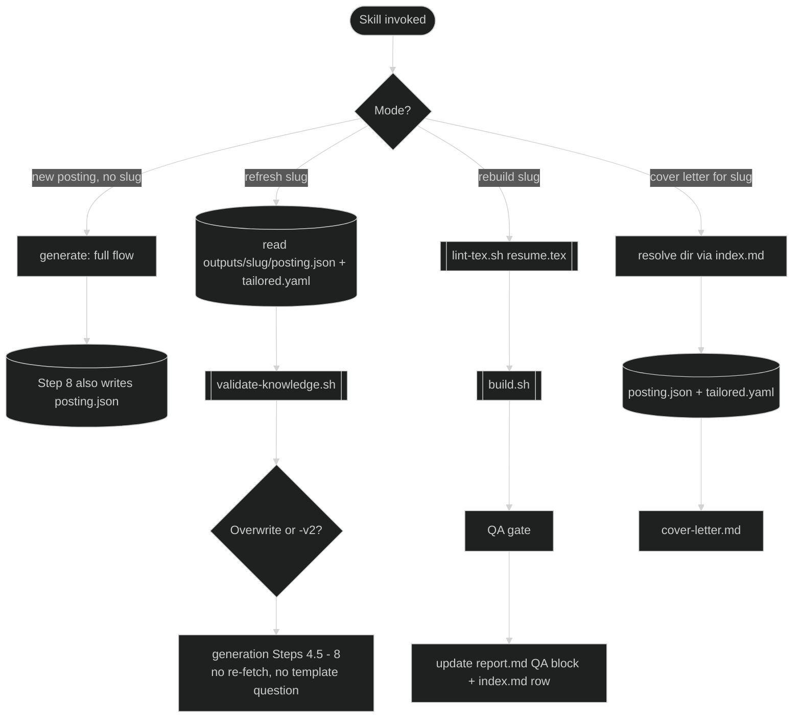

**Touches.** `SKILL.md` (argument table and mode dispatch), `generation.md` Step 8, `cover-letter.md` (resolution when no resume run precedes it). Variants unaffected.
**Risk.** Low. `posting.json` may hold copied posting text; it stays under gitignored `outputs/`.

### S5 — Script the QA gate and classify compile errors before dispatching

**Problem.** Friction point 6, plus every compile failure goes to a sonnet sub-agent even for mechanical error classes.

**Change.** Two scripts. `tests/qa-gate.sh <dir> --template N [--page-limit L] [--file f.tex]` consumes `build.sh` output, applies the budget rule (yaml `page_limit`, else template default, else the experience-years bump for template 2), the leak, refs and overfull thresholds, and emits `STATUS=pass|fail` with one `FAIL=<reason>` line per breach; exit 0/1. `tests/classify-log.sh <resume.log>` maps the `!` lines through a regex table to `CLASS=undefined-control-sequence|missing-file|missing-package|font-not-found|runaway-argument|unknown`, `LINE=`, `TOKEN=`, `HINT=`. Only `unknown` reaches the sub-agent.

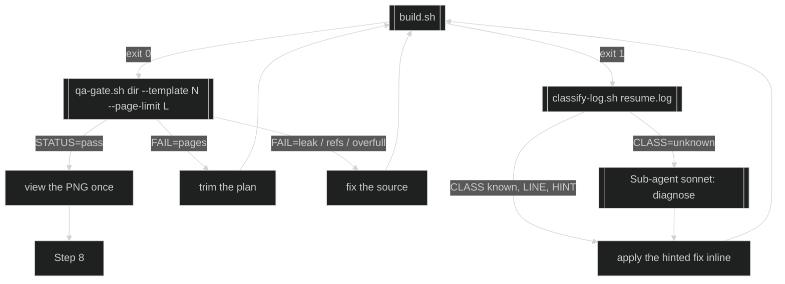

**Touches.** Two new scripts with `run-tests.sh` fixtures (sample logs for each class), `generation.md` Steps 7 and 7.5 (shrink to the exit-code table), `cover-letter.md` (`qa-gate.sh --file cover-letter.tex --page-limit 1`), `CLAUDE.md` script table. CI already runs shellcheck and `run-tests.sh`.
**Risk.** Low. Same pattern as the existing gate scripts; bash 3.2 rules apply.

### S6 — Let the soft gate defer to evidence

**Problem.** Friction point 7.

**Change.** In the Step 3 gap scan, for each gap check whether a relevant entry carries `evidence:`. If so, mark the gap deferred instead of asking. After the deep-dive (or the S3 cache) merges, re-evaluate: only gaps still open go to the user via Branch 3, now with the evidence-backed context in hand. Variants keep the rule "every question before fan-out" because with S3 the extraction itself moves into main.

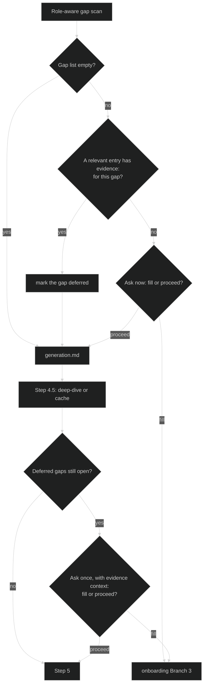

**Touches.** `SKILL.md` Step 3 (deferred list carried forward), `deep-dive.md` (return which deferred gaps it addressed), `onboarding.md` Branch 3 (may be entered from generation), `variants.md` (extraction before fan-out, from S3).
**Risk.** One user question can now appear mid-generation. Acceptable for single runs; forbidden for variants, hence the S3 dependency.

### S7 — Composable onboarding sources

**Problem.** Friction point 8.

**Change.** Branch 1 asks for any combination: a resume file or URL, one or more work directories, or nothing. Sources run as parallel sub-agents in one message (importer plus one bootstrapper per dir) and each returns a fragment. Main merges with fixed precedence: the import fills personal info, education and experience; bootstrappers fill projects, `evidence:` and `tags:`; an entry present in both (matched by `name`) keeps the import's dates and unions technologies and evidence. One validator run, one summary, one turn. The `SKILL.md` bootstrap intercept becomes "a source was given" rather than a separate branch.

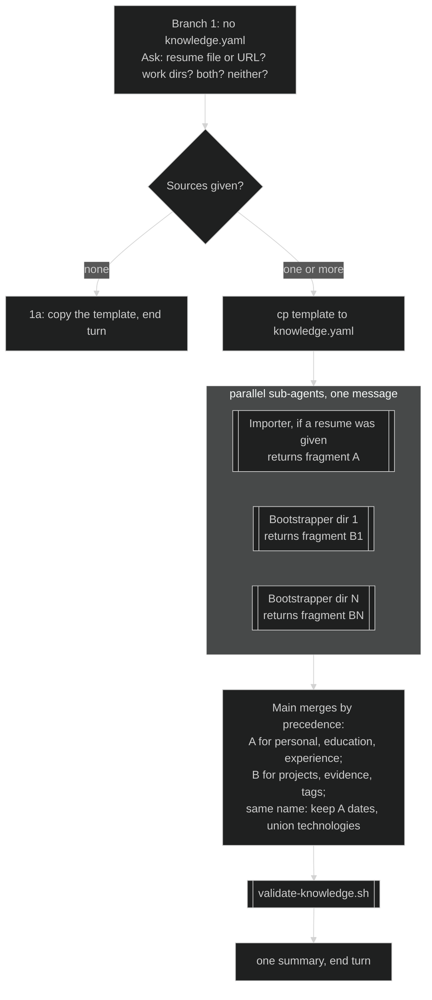

**Touches.** `onboarding.md` Branches 1, 1b, 1c (merge rules become shared), `SKILL.md` bootstrap intercept.
**Risk.** Merge conflicts on `name` need a deterministic rule; the one above is simple and documented.

### Priority

| # | Suggestion | Impact | Effort | Depends on |
|---|---|---|---|---|
| S5 | Scripted QA gate + log classifier | high: determinism, fewer sub-agent dispatches | medium: 2 scripts + fixtures | - |
| S2 | Plan then render | high: kills two LaTeX repair loops, honest `tailored.yaml` | medium: docs only | - |
| S4 | `posting.json` + refresh / rebuild / letter-later | high: iteration UX | low - medium | - |
| S3 | Evidence fact cache | medium - high: tokens on variants and regenerations | medium | S4 helps |
| S1 | Env probe at entry | medium: no late TeX surprise | low | - |
| S6 | Evidence-aware soft gate | medium: fewer questions | low | S3 |
| S7 | Composable onboarding | medium: one turn instead of two | low - medium | - |

---

## Part 4 — Combined target flow

All seven applied. Compare with 1.2 and 1.4: the same gates, fewer loops on LaTeX, more of the decisions scripted, and three re-entry modes.

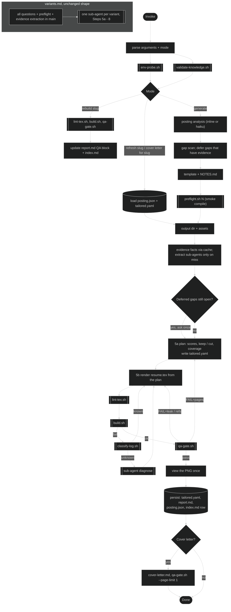

Invariants that every suggestion preserves: `knowledge.yaml` is read from the cwd and written only by onboarding; outputs stay under `<cwd>/outputs/<slug>/`; the compiler comes from the `%!TEX program` marker; sub-agents never ask the user; nothing is fabricated.
