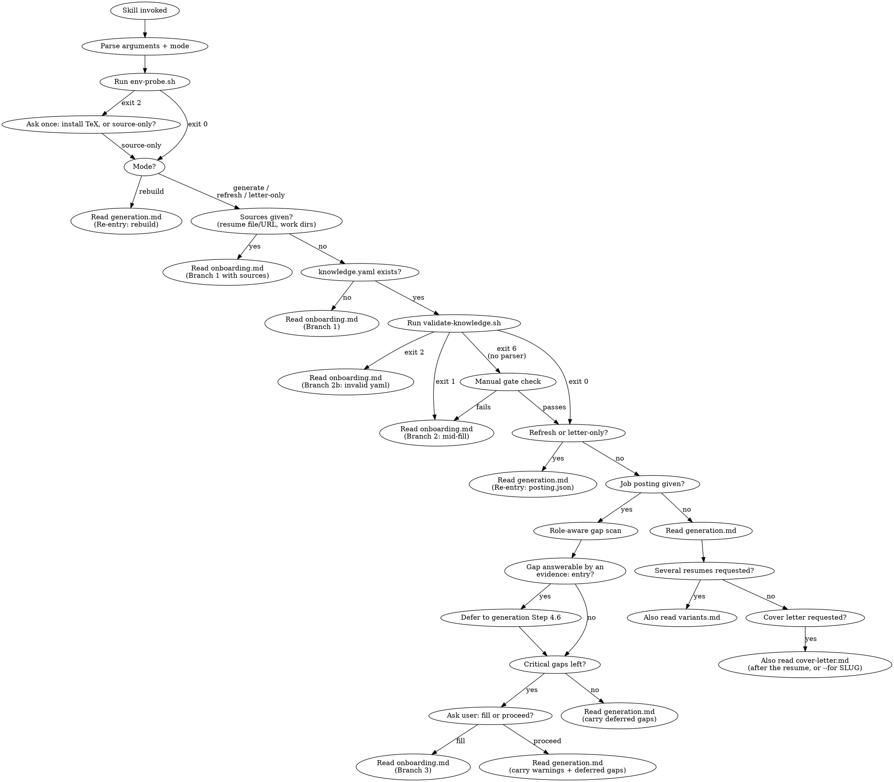

# Flow Suggestions S1-S7 Implementation Plan

> **For agentic workers:** REQUIRED SUB-SKILL: Use superpowers:subagent-driven-development (recommended) or superpowers:executing-plans to implement this plan task-by-task. Steps use checkbox (`- [ ]`) syntax for tracking.

**Goal:** Implement the seven flow changes proposed in `docs/FLOW.md` Part 3: entry-time env probe, plan-then-render, evidence fact cache, `posting.json` + re-entry modes, scripted QA gate + log classifier, evidence-aware soft gate, composable onboarding sources. Ship as plugin v0.4.0.

**Architecture:** Three new bash scripts under `skills/resume-generator/tests/` (same KEY=value stdout / exit-code contract style as the existing gate scripts, bash 3.2, tested by `run-tests.sh` without TeX). Behaviour changes live in the control docs (`SKILL.md`, `onboarding.md`, `generation.md`, `deep-dive.md`, `variants.md`, `cover-letter.md`); the DOT graph in `SKILL.md` is updated as the source of truth. Meta files (`CLAUDE.md`, `README.md`, `CHANGELOG.md`, manifests, `.gitignore`, `docs/FLOW.md`) follow.

**Tech Stack:** bash 3.2 (no `declare -A`, `mapfile`, `readarray`, `|&`, `${x,,}`, `local -n`), coreutils/grep/sed/awk only, shellcheck `-S warning` clean. Markdown control docs.

**Spec:** `docs/FLOW.md` (Part 2 friction points, Part 3 suggestions S1-S7, Part 4 target flow).

## Global Constraints

- Scripts: bash 3.2-compatible, `set -u` safe, no `set -e`; source `lib.sh` via `. "$(dirname "$0")/lib.sh"` except `env-probe.sh`, which must work with an empty `PATH` and therefore resolves its own directory with parameter expansion.
- Stdout is machine-parseable `KEY=value`; stderr is human progress. Exit codes are contracts consumed by the docs.
- `run-tests.sh` must pass with no TeX installed; shellcheck `-S warning` must pass (CI).
- Sentinel regex stays `<[A-Z][A-Za-z0-9_]*>` (`RG_SENTINEL_RE` in `lib.sh`).
- Invariants: `knowledge.yaml` is read from `<cwd>` and written only by onboarding; outputs under `<cwd>/outputs/<slug>/`; the new cache under `<cwd>/.resume-cache/evidence/` is the only other write; compiler from the `%!TEX program` marker; sub-agents never ask the user; nothing fabricated.
- Version bump: `plugin.json` and `marketplace.json` both to `0.4.0` (`check-version-sync.sh`).
- Do not commit unless the user asks (harness rule); leave the working tree for review.

---

### Task 1: `env-probe.sh` (S1)

**Files:**
- Create: `skills/resume-generator/tests/env-probe.sh`
- Modify: `skills/resume-generator/tests/run-tests.sh` (new `== env-probe.sh ==` section before `== validate-knowledge.sh ==`)

**Interfaces:**
- Produces: `bash tests/env-probe.sh` → stdout keys `STATUS=ok|no-compiler`, `PDFLATEX=`, `XELATEX=`, `LUALATEX=`, `LATEXMK=`, `PDFTOTEXT=`, `PDFINFO=`, `PDFTOPPM=`, `PYTHON3=`, `PYYAML=yes|no`, `DISTRO=`, `INSTALL_CMD=` (only on no-compiler), `SUMMARY=`; exit 0 ok, 2 no-compiler. Consumed by `SKILL.md` Step 1 (Task 6).

- [ ] **Step 1: Write the failing tests** (append to `run-tests.sh` before the `== validate-knowledge.sh ==` block)

```bash
echo "== env-probe.sh =="
E="$T/env-probe.sh"
mkdir -p "$tmp/emptybin"
run env PATH="$tmp/emptybin" bash "$E"
expect "env-probe: empty PATH -> exit 2, no-compiler, PYYAML=no" 2 "STATUS=no-compiler" "PDFLATEX=" "XELATEX=" "PYYAML=no" "DISTRO=unknown" "INSTALL_CMD=#"
if hasre '^PDFLATEX=$' && hasre '^LATEXMK=$'; then ok "env-probe: empty PATH leaves tool paths empty"; else bad "env-probe: empty PATH tool paths" "$(oneline)"; fi
run bash "$E"
if have pdflatex || have xelatex; then
  expect "env-probe: this machine -> STATUS=ok" 0 "STATUS=ok" "DISTRO=" "PYYAML="
else
  expect "env-probe: this machine -> no-compiler" 2 "STATUS=no-compiler"
fi
if [ "$have_yaml" -eq 1 ]; then has "PYYAML=yes" && ok "env-probe: PYYAML=yes matches the validator's parser" || bad "env-probe: PYYAML" "$(oneline)"; fi
run bash "$E" extra
expect "env-probe: any argument -> exit 4" 4
```

Note: `have_yaml` is computed in the validate section today; move those four lines (`have_yaml=0 … fi`) above the env-probe section so both can use it.

- [ ] **Step 2: Run tests to verify they fail**

Run: `bash skills/resume-generator/tests/run-tests.sh 2>&1 | grep -E 'env-probe|Tests:'`
Expected: FAIL lines for env-probe (script missing → bash exit 127 ≠ expected).

- [ ] **Step 3: Write the script**

```bash
#!/usr/bin/env bash
# env-probe.sh - one-second, template-agnostic environment probe.
#
# Run at entry (SKILL.md Step 1) so a missing TeX compiler is surfaced before
# any question is asked. preflight.sh <N> still does the per-template smoke
# compile later; this script never compiles anything.
#
# Usage: env-probe.sh            (no arguments)
#
# Stdout (KEY=value):
#   STATUS=ok|no-compiler        ok when pdflatex or xelatex is on PATH
#   PDFLATEX=<path or empty>
#   XELATEX=<path or empty>
#   LUALATEX=<path or empty>
#   LATEXMK=<path or empty>      build.sh uses it when present
#   PDFTOTEXT=<path or empty>    leak / ATS text check available when set
#   PDFINFO=<path or empty>
#   PDFTOPPM=<path or empty>     page-1 PNG render available when set
#   PYTHON3=<path or empty>
#   PYYAML=yes|no                yes: validate-knowledge.sh uses the python parser; no: it exits 6
#   DISTRO=miktex|debian|fedora|texlive|unknown
#   INSTALL_CMD=<hint>           only when STATUS=no-compiler (one or more lines)
#   SUMMARY=<one line>
#
# Exit: 0 ok, 2 no compiler, 4 arguments given
#
# Deliberately uses only bash builtins plus `python3 -c` (when python3 exists)
# so it behaves with an empty PATH; the directory of this file is resolved
# without `dirname` for the same reason.

set -u

case "$0" in
  */*) here="${0%/*}" ;;
  *)   here="." ;;
esac
# shellcheck source=lib.sh
. "$here/lib.sh"

if [ "$#" -ne 0 ]; then
  echo "usage: $0    (no arguments)" >&2
  exit 4
fi

path_of() {
  command -v "$1" 2>/dev/null || true
}

pdflatex_p="$(path_of pdflatex)"
xelatex_p="$(path_of xelatex)"
lualatex_p="$(path_of lualatex)"
latexmk_p="$(path_of latexmk)"
pdftotext_p="$(path_of pdftotext)"
pdfinfo_p="$(path_of pdfinfo)"
pdftoppm_p="$(path_of pdftoppm)"
python3_p="$(path_of python3)"

pyyaml=no
if [ -n "$python3_p" ] && "$python3_p" -c 'import yaml' >/dev/null 2>&1; then
  pyyaml=yes
fi

distro="$(detect_distro)"

printf 'PDFLATEX=%s\n' "$pdflatex_p"
printf 'XELATEX=%s\n' "$xelatex_p"
printf 'LUALATEX=%s\n' "$lualatex_p"
printf 'LATEXMK=%s\n' "$latexmk_p"
printf 'PDFTOTEXT=%s\n' "$pdftotext_p"
printf 'PDFINFO=%s\n' "$pdfinfo_p"
printf 'PDFTOPPM=%s\n' "$pdftoppm_p"
printf 'PYTHON3=%s\n' "$python3_p"
printf 'PYYAML=%s\n' "$pyyaml"
printf 'DISTRO=%s\n' "$distro"

if [ -z "$pdflatex_p" ] && [ -z "$xelatex_p" ]; then
  echo "STATUS=no-compiler"
  echo "INSTALL_CMD=# install MiKTeX (https://miktex.org) or TeX Live (https://tug.org/texlive), then re-invoke"
  echo "INSTALL_CMD=# Debian/Ubuntu: sudo apt install texlive-latex-extra texlive-xetex texlive-fonts-extra latexmk"
  echo "INSTALL_CMD=# Fedora: sudo dnf install texlive-scheme-medium texlive-xetex latexmk"
  echo "INSTALL_CMD=# macOS: brew install --cask mactex-no-gui"
  echo "SUMMARY=no pdflatex or xelatex on PATH; install TeX or continue source-only"
  exit 2
fi

echo "STATUS=ok"
missing=""
[ -n "$pdftotext_p" ] || missing="$missing pdftotext"
[ -n "$pdftoppm_p" ]  || missing="$missing pdftoppm"
[ "$pyyaml" = yes ]   || missing="$missing PyYAML"
if [ -n "$missing" ]; then
  echo "SUMMARY=compiler present; optional tools missing:${missing} (QA text/PNG checks or the scripted gate degrade)"
else
  echo "SUMMARY=compiler, poppler and PyYAML all present"
fi
exit 0
```

- [ ] **Step 4: Run tests to verify they pass**

Run: `bash skills/resume-generator/tests/run-tests.sh 2>&1 | grep -E 'env-probe|portable|bash -n|Tests:'`
Expected: all env-probe PASS, `bash -n env-probe.sh` PASS, `portable bash: env-probe.sh` PASS.

- [ ] **Step 5: shellcheck**

Run: `shellcheck -S warning skills/resume-generator/tests/env-probe.sh` (skip if shellcheck is absent; CI runs it)

---

### Task 2: `classify-log.sh` (S5, part 1)

**Files:**
- Create: `skills/resume-generator/tests/classify-log.sh`
- Create fixtures: `tests/fixtures/log-undefined-cs.log`, `log-missing-sty.log`, `log-missing-cls.log`, `log-font.log`, `log-runaway.log`, `log-clean.log`, `log-unknown.log`
- Modify: `run-tests.sh` (new `== classify-log.sh ==` section after `== lint-tex.sh ==`)

**Interfaces:**
- Produces: `bash tests/classify-log.sh <file.log>` → `STATUS=classified|unknown|no-error`, `CLASS=`, `ERROR=`, `LINE=`, `TOKEN=`, `HINT=`; exit 0 classified, 1 unknown, 3 not found, 4 args, 5 no error line. Consumed by `generation.md` Step 7 (Task 5).

- [ ] **Step 1: Write fixtures**

`log-undefined-cs.log`:
```
This is pdfTeX, Version 3.141592653-2.6-1.40.25 (TeX Live 2023) (preloaded format=pdflatex)
 restricted \write18 enabled.
entering extended mode
(./resume.tex
LaTeX2e <2023-11-01> patch level 1
(./resume.cls
Document Class: resume 2010/07/10 v0.9 Resume class
)
! Undefined control sequence.
l.42 \sectionn
              {Experience}
? 
! Emergency stop.
l.42 \sectionn
              {Experience}
No pages of output.
```

`log-missing-sty.log`:
```
This is pdfTeX, Version 3.141592653-2.6-1.40.25 (TeX Live 2023) (preloaded format=pdflatex)
(./resume.tex
LaTeX2e <2023-11-01> patch level 1

! LaTeX Error: File `ebgaramond.sty' not found.

Type X to quit or <RETURN> to proceed,
or enter new name. (Default extension: sty)

Enter file name: 
! Emergency stop.
<read *> 
         
l.5 \usepackage
               {ebgaramond}^^M
```

`log-missing-cls.log`:
```
This is pdfTeX, Version 3.141592653-2.6-1.40.25 (TeX Live 2023) (preloaded format=pdflatex)
(./resume.tex
LaTeX2e <2023-11-01> patch level 1

! LaTeX Error: File `resume.cls' not found.

Type X to quit or <RETURN> to proceed,
or enter new name. (Default extension: cls)

Enter file name: 
! Emergency stop.
<read *> 
         
l.2 \documentclass
                  {resume}^^M
```

`log-font.log`:
```
This is XeTeX, Version 3.141592653-2.6-0.999995 (TeX Live 2023) (preloaded format=xelatex)
(./resume.tex
LaTeX2e <2023-11-01> patch level 1
(/usr/share/texlive/texmf-dist/tex/latex/fontspec/fontspec.sty

! fontspec error: "font-not-found"
! 
! The font "Alegreya" cannot be found.
! 
! See the fontspec documentation for further information.
! 
! For immediate help type H <return>.
!...............................................  
                                                  
l.30 \setmainfont{Alegreya}
                           
```

`log-runaway.log`:
```
This is pdfTeX, Version 3.141592653-2.6-1.40.25 (TeX Live 2023) (preloaded format=pdflatex)
(./resume.tex
LaTeX2e <2023-11-01> patch level 1
Runaway argument?
{Senior Engineer \\ Acme \\ 2021--present \begin {itemize} \item Built the thing 
! File ended while scanning use of \@resumeSubheading.
<inserted text> 
                \par 
<*> resume.tex
            
! Emergency stop.
<*> resume.tex
```

`log-clean.log`:
```
This is pdfTeX, Version 3.141592653-2.6-1.40.25 (TeX Live 2023) (preloaded format=pdflatex)
(./resume.tex
LaTeX2e <2023-11-01> patch level 1
(./resume.cls) (./resume.aux)
Overfull \hbox (3.2pt too wide) in paragraph at lines 40--41
[1{/usr/share/texlive/texmf-var/fonts/map/pdftex/updmap/pdftex.map}] (./resume.aux) )
Output written on resume.pdf (1 page, 51234 bytes).
```

`log-unknown.log`:
```
This is pdfTeX, Version 3.141592653-2.6-1.40.25 (TeX Live 2023) (preloaded format=pdflatex)
(./resume.tex
! Something bizarre happened here.
l.7 \weird
? 
```

- [ ] **Step 2: Write the failing tests**

```bash
echo "== classify-log.sh =="
C="$T/classify-log.sh"
run bash "$C" "$FX/log-undefined-cs.log"
expect "classify: undefined control sequence" 0 "STATUS=classified" "CLASS=undefined-control-sequence" "LINE=42" "TOKEN=\\sectionn" "HINT="
run bash "$C" "$FX/log-missing-sty.log"
expect "classify: missing .sty -> missing-package" 0 "CLASS=missing-package" "TOKEN=ebgaramond.sty" "LINE=5"
run bash "$C" "$FX/log-missing-cls.log"
expect "classify: missing .cls -> missing-class" 0 "CLASS=missing-class" "TOKEN=resume.cls" "Step 4"
run bash "$C" "$FX/log-font.log"
expect "classify: fontspec font-not-found" 0 "CLASS=font-not-found" "TOKEN=Alegreya" "LINE=30"
run bash "$C" "$FX/log-runaway.log"
expect "classify: runaway argument" 0 "CLASS=runaway-argument" "TOKEN=\\@resumeSubheading"
run bash "$C" "$FX/log-clean.log"
expect "classify: clean log -> exit 5 no-error" 5 "STATUS=no-error" "CLASS=none"
run bash "$C" "$FX/log-unknown.log"
expect "classify: unknown error -> exit 1" 1 "STATUS=unknown" "CLASS=unknown" "ERROR=! Something bizarre" "LINE=7"
printf '(./resume.tex\n! Missing $ inserted.\n<inserted text> \n                $\nl.19 Grew ARR 40%% to $\n                       2M.\n' > "$tmp/dollar.log"
run bash "$C" "$tmp/dollar.log"
expect "classify: missing dollar" 0 "CLASS=missing-dollar" "LINE=19"
printf '(./resume.tex\n! Too many }'"'"'s.\nl.23 \\item{Built it}}\n' > "$tmp/brace.log"
run bash "$C" "$tmp/brace.log"
expect "classify: extra brace" 0 "CLASS=extra-brace" "LINE=23"
printf '(./resume.tex\n! LaTeX Error: Environment rSection undefined.\n\nl.31 \\begin{rSection}\n' > "$tmp/env.log"
run bash "$C" "$tmp/env.log"
expect "classify: undefined environment" 0 "CLASS=undefined-environment" "TOKEN=rSection" "LINE=31"
printf '(./resume.tex\n! Package geometry Error: \\paperwidth (0.0pt) too short.\n\nl.9 \\usepackage[margin=0in]{geometry}\n' > "$tmp/pkg.log"
run bash "$C" "$tmp/pkg.log"
expect "classify: package error" 0 "CLASS=package-error" "TOKEN=geometry" "LINE=9"
run bash "$C" "$tmp/nope.log"
expect "classify: missing log -> exit 3" 3 "STATUS=not-found"
run bash "$C"
expect "classify: no args -> exit 4" 4
```

- [ ] **Step 3: Run tests to verify they fail**

Run: `bash skills/resume-generator/tests/run-tests.sh 2>&1 | grep -E 'classify|Tests:'`
Expected: FAIL for every classify case.

- [ ] **Step 4: Write the script**

```bash
#!/usr/bin/env bash
# classify-log.sh - classify the first LaTeX error in a compile log.
#
# The common, mechanical compile failures get a deterministic fix hint so
# generation.md Step 7 can repair them inline; only STATUS=unknown needs a
# diagnosis sub-agent.
#
# Usage: classify-log.sh <file.log>
#
# Stdout (KEY=value):
#   STATUS=classified|unknown|no-error|not-found
#   CLASS=<see table>|unknown|none
#   ERROR=<the first line starting with "! ">
#   LINE=<n>            the "l.<n>" input line TeX printed after the error, when present
#   TOKEN=<text>        the macro / file / font / environment / package the error names
#   HINT=<one-line fix>
#
# CLASS (first match wins):
#   missing-class               ! LaTeX Error: File `x.cls' not found.
#   missing-package             ! LaTeX Error: File `x.sty' not found.
#   missing-file                ! LaTeX Error: File `x' not found.  /  ! I can't find file `x'.
#   font-not-found              fontspec "font-not-found", The font "X" cannot be found, Font \x=X ... not loadable
#   undefined-control-sequence  ! Undefined control sequence.
#   undefined-environment       ! LaTeX Error: Environment x undefined.
#   missing-begin-document      ! LaTeX Error: Missing \begin{document}.
#   missing-dollar              ! Missing $ inserted.
#   extra-brace                 ! Too many }'s.
#   runaway-argument            ! File ended while scanning use of \x. / ! Paragraph ended before \x was complete.
#   unknown-option              ! LaTeX Error: Unknown option `x' for package `y'.
#   package-error               ! Package x Error: ...
#   unknown                     any other "! " line
#
# Exit: 0 classified, 1 unknown, 3 log not found, 4 args, 5 no "! " line in the log

set -u

# shellcheck source-path=SCRIPTDIR
# shellcheck source=lib.sh
. "$(dirname "$0")/lib.sh"

if [ "$#" -ne 1 ]; then
  echo "usage: $0 <file.log>" >&2
  exit 4
fi
log="$1"
if [ ! -f "$log" ]; then
  echo "STATUS=not-found"
  exit 3
fi

clean="$(tr -d '\r' < "$log")"
first="$(printf '%s\n' "$clean" | grep -nE '^! ' | head -n 1)"
if [ -z "$first" ]; then
  echo "STATUS=no-error"
  echo "CLASS=none"
  echo "SUMMARY=no LaTeX error line in $(basename "$log"); the failure is outside LaTeX (timeout, disk, missing binary)"
  exit 5
fi
n="${first%%:*}"
err="${first#*:}"
ctx="$(printf '%s\n' "$clean" | sed -n "$((n + 1)),$((n + 20))p")"

line="$(printf '%s\n' "$ctx" | grep -oE '^l\.[0-9]+' | head -n 1 | cut -c3-)"
lline="$(printf '%s\n' "$ctx" | grep -E '^l\.[0-9]+' | head -n 1)"

# between_ticks <text>: the part between the first ` and the following '
between_ticks() {
  local t="$1"
  t="${t#*\`}"
  t="${t%%\'*}"
  printf '%s\n' "$t"
}
first_macro() {
  printf '%s\n' "$1" | grep -oE '\\[A-Za-z@]+' | head -n 1
}
last_macro() {
  printf '%s\n' "$1" | grep -oE '\\[A-Za-z@]+' | tail -n 1
}

class=unknown
token=""
hint=""
where="${line:+ near line $line}"

case "$err" in
  *"File \`"*".cls' not found"*)
    class=missing-class
    token="$(between_ticks "$err")"
    hint="Class file $token is not in the output dir: re-run generation Step 4 (copy the template's .cls/.sty/fonts next to resume.tex)"
    ;;
  *"File \`"*".sty' not found"*)
    class=missing-package
    token="$(between_ticks "$err")"
    hint="Package ${token%.sty} is not installed: run preflight.sh <N> install (MiKTeX/TeX Live) or copy the .sty next to resume.tex if it is a template asset"
    ;;
  *"File \`"*"' not found"*|*"I can't find file \`"*)
    class=missing-file
    token="$(between_ticks "$err")"
    hint="File $token is referenced$where but absent from the output dir (photo, structure.tex, fonts): copy it or remove the reference"
    ;;
  *"fontspec error"*"font-not-found"*|*"cannot be found"*|*"not loadable"*)
    class=font-not-found
    token="$(printf '%s\n%s\n' "$err" "$ctx" | grep -oE '"[^"]+" cannot be found' | head -n 1 | sed 's/" cannot be found$//; s/^"//')"
    if [ -z "$token" ]; then
      token="$(printf '%s\n' "$err" | sed -nE 's/.*=([^ ]+) at .*not loadable.*/\1/p' | head -n 1)"
    fi
    hint="Font ${token:-?} not found$where: the template's font dir was not copied or its case is wrong (Fonts/ vs fonts/), or the file was compiled with pdflatex instead of xelatex"
    ;;
  *"Undefined control sequence"*)
    class=undefined-control-sequence
    token="$(last_macro "$lline")"
    hint="Macro ${token:-?} is not defined for this template$where: check the macro name and arity in templates/<N>/NOTES.md, or a typo"
    ;;
  *"Environment "*" undefined"*)
    class=undefined-environment
    token="$(printf '%s\n' "$err" | sed -nE 's/.*Environment ([^ ]+) undefined.*/\1/p')"
    hint="Environment ${token:-?} is unknown to this class$where: use the environment named in templates/<N>/NOTES.md"
    ;;
  *"Missing \\begin{document}"*)
    class=missing-begin-document
    hint="Body text or a stray character appears before \\begin{document}$where: move it after, or escape it"
    ;;
  *"Missing \$ inserted"*)
    class=missing-dollar
    hint="An unescaped _ ^ or math character in text mode$where: escape it (\\_ \\textasciicircum{} \\$)"
    ;;
  *"Too many }'s"*)
    class=extra-brace
    hint="A stray } $where: count the brace arguments of that macro call against templates/<N>/NOTES.md"
    ;;
  *"File ended while scanning use of"*|*"Paragraph ended before"*)
    class=runaway-argument
    token="$(first_macro "$err")"
    hint="An argument of ${token:-?} is never closed: a missing } or an unescaped { in the text it wraps (the runaway text is printed above the error)"
    ;;
  *"Unknown option"*)
    class=unknown-option
    token="$(between_ticks "$err")"
    hint="Option $token is not accepted$where: drop it or check the package documentation"
    ;;
  *"Package "*" Error"*)
    class=package-error
    token="$(printf '%s\n' "$err" | sed -nE 's/.*Package ([^ ]+) Error.*/\1/p')"
    hint="Package ${token:-?} rejected the input$where: read the message and fix the named argument"
    ;;
esac

echo "ERROR=$err"
[ -n "$line" ]  && echo "LINE=$line"
[ -n "$token" ] && echo "TOKEN=$token"
if [ "$class" = unknown ]; then
  echo "CLASS=unknown"
  echo "HINT=not a known mechanical failure; dispatch the diagnosis sub-agent with the paths to resume.log and resume.tex"
  echo "STATUS=unknown"
  exit 1
fi
echo "CLASS=$class"
echo "HINT=$hint"
echo "STATUS=classified"
exit 0
```

- [ ] **Step 5: Run tests to verify they pass**

Run: `bash skills/resume-generator/tests/run-tests.sh 2>&1 | grep -E 'classify|Tests:'`
Expected: all PASS. If `TOKEN=\\sectionn` fails, check that `expect` compares with `grep -qF` (it does) and that the fixture's `l.42 \sectionn` line is intact.

- [ ] **Step 6: shellcheck**

Run: `shellcheck -S warning skills/resume-generator/tests/classify-log.sh`

---

### Task 3: `qa-gate.sh` (S5, part 2)

**Files:**
- Create: `skills/resume-generator/tests/qa-gate.sh`
- Modify: `run-tests.sh` (new `== qa-gate.sh ==` section after `== build.sh ==`)

**Interfaces:**
- Consumes: `build.sh` stdout keys (`STATUS`, `PAGES`, `OVERFULL`, `PLACEHOLDER_LEAK`, `UNRESOLVED_REFS`, `TEXT_EXTRACT`, `LEAK=`, `PNG`).
- Produces: `bash tests/qa-gate.sh <dir> --template N [--page-limit L] [--experience-years Y] [--file f.tex] [--compiler X] [--no-render] [--allow S]... [--from build.out]` → echoes every build key, then `BUDGET=`, `FAIL=` lines, `WARN=` lines, `STATUS=pass|fail|no-compiler|compile-failed`, `SUMMARY=`; exit 0 pass, 1 fail, 2 no compiler, 3 dir or `--from` file missing, 4 args, 5 compile failed. Consumed by `generation.md` Step 7 and `cover-letter.md` (Tasks 5, 8).

- [ ] **Step 1: Write the failing tests**

```bash
echo "== qa-gate.sh =="
Q="$T/qa-gate.sh"
qdir="$tmp/qa"
mkdir -p "$qdir"
cp "$FX/good.tex" "$qdir/resume.tex"
mk_out() {  # mk_out <file> <pages> <overfull> <placeholder> <refs> <text> [leak...]
  local f="$1" pages="$2" over="$3" ph="$4" refs="$5" text="$6"
  shift 6
  {
    echo "STATUS=ok"; echo "COMPILER=pdflatex"; echo "PDF=$qdir/resume.pdf"
    echo "PAGES=$pages"; echo "OVERFULL=$over"; echo "UNDERFULL=0"; echo "TEXT_EXTRACT=$text"
    if [ "$text" = ok ]; then echo "PLACEHOLDER_LEAK=$ph"; echo "UNRESOLVED_REFS=$refs"; fi
    for l in ${1+"$@"}; do echo "LEAK=$l"; done
    echo "PNG=$qdir/resume-p1.png"
  } > "$f"
}
mk_out "$tmp/q-pass.out" 1 2 0 0 ok
run bash "$Q" "$qdir" --from "$tmp/q-pass.out" --template 2
expect "qa-gate: clean build passes" 0 "STATUS=pass" "BUDGET=1" "PAGES=1" "PNG=$qdir/resume-p1.png"
mk_out "$tmp/q-2p.out" 2 0 0 0 ok
run bash "$Q" "$qdir" --from "$tmp/q-2p.out" --template 2
expect "qa-gate: 2 pages on template 2 fails" 1 "STATUS=fail" "FAIL=pages:2/1"
run bash "$Q" "$qdir" --from "$tmp/q-2p.out" --template 2 --experience-years 12
expect "qa-gate: template 2 with >8 years gets a 2-page budget" 0 "STATUS=pass" "BUDGET=2"
run bash "$Q" "$qdir" --from "$tmp/q-2p.out" --template 2 --experience-years 8
expect "qa-gate: exactly 8 years keeps 1 page" 1 "BUDGET=1"
run bash "$Q" "$qdir" --from "$tmp/q-2p.out" --template 3
expect "qa-gate: template 3 default budget is 2" 0 "BUDGET=2"
run bash "$Q" "$qdir" --from "$tmp/q-2p.out" --template 3 --page-limit 1
expect "qa-gate: --page-limit overrides the template default" 1 "BUDGET=1" "FAIL=pages:2/1"
run bash "$Q" "$qdir" --from "$tmp/q-2p.out" --template 3 --file cover-letter.tex
expect "qa-gate: a non-resume --file (cover letter) is budgeted at 1 page" 1 "BUDGET=1"
mk_out "$tmp/q-leak.out" 1 0 0 0 ok "John Smith" "MIT"
run bash "$Q" "$qdir" --from "$tmp/q-leak.out" --template 2
expect "qa-gate: LEAK lines fail" 1 "FAIL=leak:John Smith" "FAIL=leak:MIT"
run bash "$Q" "$qdir" --from "$tmp/q-leak.out" --template 2 --allow "MIT" --allow "John Smith"
expect "qa-gate: --allow whitelists genuine strings" 0 "STATUS=pass"
mk_out "$tmp/q-ph.out" 1 0 3 0 ok
run bash "$Q" "$qdir" --from "$tmp/q-ph.out" --template 2
expect "qa-gate: placeholder leak fails" 1 "FAIL=placeholder-leak:3"
mk_out "$tmp/q-refs.out" 1 0 0 2 ok
run bash "$Q" "$qdir" --from "$tmp/q-refs.out" --template 2
expect "qa-gate: unresolved refs fail" 1 "FAIL=unresolved-refs:2"
mk_out "$tmp/q-over.out" 1 9 0 0 ok
run bash "$Q" "$qdir" --from "$tmp/q-over.out" --template 2
expect "qa-gate: overfull > 5 is a warning, not a failure" 0 "STATUS=pass" "WARN=overfull:9"
mk_out "$tmp/q-notext.out" 1 0 0 0 unavailable
run bash "$Q" "$qdir" --from "$tmp/q-notext.out" --template 2
expect "qa-gate: no pdftotext -> warning, leak checks unmeasured" 0 "STATUS=pass" "WARN=text-extract:unavailable"
mk_out "$tmp/q-empty.out" 1 0 0 0 empty
run bash "$Q" "$qdir" --from "$tmp/q-empty.out" --template 2
expect "qa-gate: empty text layer -> warning" 0 "WARN=text-extract:empty"
printf 'STATUS=compile-failed\nCOMPILER=pdflatex\n' > "$tmp/q-cf.out"
run bash "$Q" "$qdir" --from "$tmp/q-cf.out" --template 2
expect "qa-gate: compile-failed passes through as exit 5" 5 "STATUS=compile-failed"
printf 'STATUS=no-compiler\nCOMPILER=xelatex\n' > "$tmp/q-nc.out"
run bash "$Q" "$qdir" --from "$tmp/q-nc.out" --template 3
expect "qa-gate: no-compiler passes through as exit 2" 2 "STATUS=no-compiler"
run bash "$Q" "$qdir" --from "$tmp/q-pass.out"
expect "qa-gate: --template is required" 4
run bash "$Q" "$qdir" --from "$tmp/q-pass.out" --template 99
expect "qa-gate: unknown template -> exit 4" 4
run bash "$Q" "$qdir" --from "$tmp/missing.out" --template 2
expect "qa-gate: missing --from file -> exit 3" 3
run bash "$Q" "$tmp/no-such" --template 2
expect "qa-gate: missing dir -> exit 3" 3
run bash "$Q"
expect "qa-gate: no args -> exit 4" 4
if have pdflatex; then
  skipt "qa-gate: live no-compiler path" "pdflatex is present"
else
  run bash "$Q" "$qdir" --template 2
  expect "qa-gate: live run without TeX -> exit 2" 2 "STATUS=no-compiler"
fi
```

- [ ] **Step 2: Run tests to verify they fail**

Run: `bash skills/resume-generator/tests/run-tests.sh 2>&1 | grep -E 'qa-gate|Tests:'`

- [ ] **Step 3: Write the script**

```bash
#!/usr/bin/env bash
# qa-gate.sh - scripted post-compile QA gate (generation.md Step 7).
#
# Runs build.sh in <output-dir> (or reads a saved build.sh output with --from,
# for tests and re-checks), echoes every build key, then applies the page
# budget and leak rules deterministically so the docs never do the arithmetic.
#
# Usage:
#   qa-gate.sh <output-dir> --template N [--page-limit L] [--experience-years Y]
#              [--file name.tex] [--compiler X] [--no-render] [--allow <string>]...
#   qa-gate.sh <output-dir> --from <build.out> --template N [...]
#
# BUDGET (pages allowed), first rule that applies:
#   --page-limit L                     the yaml's page_limit
#   --file other than resume.tex       1 (a cover letter)
#   template default                   1:1  2:1  3:2  4:2  5:2  6:1, and template 2
#                                      becomes 2 when --experience-years is above 8
# FAIL= lines (any FAIL -> STATUS=fail, exit 1):
#   pages:<n>/<budget>                 PAGES above BUDGET
#   placeholder-leak:<n>               PLACEHOLDER_LEAK above 0
#   leak:<string>                      each LEAK= line not covered by --allow
#   unresolved-refs:<n>                UNRESOLVED_REFS above 0
# WARN= lines (never fail):
#   overfull:<n>                       OVERFULL above 5
#   text-extract:empty                 the PDF has no text layer (ATS sees nothing)
#   text-extract:unavailable           no pdftotext: leak and refs checks unmeasured
#   png:none                           no page-1 render to look at
#
# Stdout: the build.sh lines first (STATUS from build is re-emitted as BUILD_STATUS),
#   then BUDGET=, FAIL=..., WARN=..., PNG= (when present), STATUS=pass|fail|no-compiler|compile-failed, SUMMARY=
# Exit: 0 pass, 1 fail, 2 no compiler, 3 <output-dir> or --from file missing,
#       4 arguments, 5 compile failed (run classify-log.sh on the .log)

set -u

# shellcheck source-path=SCRIPTDIR
# shellcheck source=lib.sh
. "$(dirname "$0")/lib.sh"

usage() {
  echo "usage: $0 <output-dir> --template N [--page-limit L] [--experience-years Y] [--file name.tex] [--compiler X] [--no-render] [--allow <string>]... [--from <build.out>]" >&2
}
die_args() {
  echo "qa-gate: $1" >&2
  usage
  exit 4
}
is_int() {
  case "$1" in
    ''|*[!0-9]*) return 1 ;;
    *) return 0 ;;
  esac
}

dir=""
template=""
page_limit=""
years=""
texfile="resume.tex"
from=""
allow="
"
pass_args=""

while [ "$#" -gt 0 ]; do
  case "$1" in
    --template)         [ "$#" -ge 2 ] || die_args "--template needs a value"; template="$2"; shift 2 ;;
    --template=*)       template="${1#*=}"; shift ;;
    --page-limit)       [ "$#" -ge 2 ] || die_args "--page-limit needs a value"; page_limit="$2"; shift 2 ;;
    --page-limit=*)     page_limit="${1#*=}"; shift ;;
    --experience-years) [ "$#" -ge 2 ] || die_args "--experience-years needs a value"; years="$2"; shift 2 ;;
    --experience-years=*) years="${1#*=}"; shift ;;
    --file)             [ "$#" -ge 2 ] || die_args "--file needs a value"; texfile="$2"; pass_args="$pass_args --file $2"; shift 2 ;;
    --file=*)           texfile="${1#*=}"; pass_args="$pass_args --file ${1#*=}"; shift ;;
    --compiler)         [ "$#" -ge 2 ] || die_args "--compiler needs a value"; pass_args="$pass_args --compiler $2"; shift 2 ;;
    --compiler=*)       pass_args="$pass_args --compiler ${1#*=}"; shift ;;
    --no-render)        pass_args="$pass_args --no-render"; shift ;;
    --allow)            [ "$#" -ge 2 ] || die_args "--allow needs a value"; allow="$allow$2
"; shift 2 ;;
    --allow=*)          allow="$allow${1#*=}
"; shift ;;
    --from)             [ "$#" -ge 2 ] || die_args "--from needs a value"; from="$2"; shift 2 ;;
    --from=*)           from="${1#*=}"; shift ;;
    -h|--help)          usage; exit 0 ;;
    -*)                 die_args "unknown option: $1" ;;
    *)                  [ -z "$dir" ] || die_args "unexpected extra argument: $1"; dir="$1"; shift ;;
  esac
done

[ -n "$dir" ] || die_args "missing <output-dir>"
[ -n "$template" ] || die_args "--template N is required"
is_int "$template" || die_args "--template must be a number"
if ! list_templates | grep -qx "$template"; then
  die_args "unknown template $template (no templates/$template/template.tex)"
fi
[ -z "$page_limit" ] || is_int "$page_limit" || die_args "--page-limit must be a number"
[ -z "$years" ] || is_int "$years" || die_args "--experience-years must be a number"
case "$texfile" in
  ''|*/*|*\\*) die_args "--file must be a bare file name" ;;
esac

if [ ! -d "$dir" ]; then
  echo "qa-gate: not a directory: $dir" >&2
  echo "STATUS=not-found"
  exit 3
fi
dir="$(abs_dir "$dir")"

tmp="$(mktemp -d)"
trap 'rm -rf "$tmp"' EXIT
bout="$tmp/build.out"

if [ -n "$from" ]; then
  if [ ! -f "$from" ]; then
    echo "qa-gate: --from file not found: $from" >&2
    echo "STATUS=not-found"
    exit 3
  fi
  tr -d '\r' < "$from" > "$bout"
else
  # shellcheck disable=SC2086  # pass_args is a deliberately word-split option list
  bash "$RG_LIB_DIR/build.sh" "$dir" --template "$template" $pass_args > "$bout"
fi

get() {
  sed -n "s/^$1=//p" "$bout" | head -n 1
}

# Echo the build lines, renaming STATUS so the gate's own STATUS is the last word.
sed 's/^STATUS=/BUILD_STATUS=/' "$bout"

bstatus="$(get STATUS)"
case "$bstatus" in
  ok) ;;
  no-compiler)
    echo "STATUS=no-compiler"
    echo "SUMMARY=no compiler for this template; source-only or install TeX (preflight.sh)"
    exit 2
    ;;
  compile-failed)
    echo "STATUS=compile-failed"
    echo "SUMMARY=compile failed; run classify-log.sh $dir/${texfile%.tex}.log"
    exit 5
    ;;
  *)
    echo "STATUS=compile-failed"
    echo "SUMMARY=build.sh returned no usable STATUS (got '$bstatus')"
    exit 5
    ;;
esac

# Budget
if [ -n "$page_limit" ]; then
  budget="$page_limit"
elif [ "$texfile" != "resume.tex" ]; then
  budget=1
else
  case "$template" in
    3|4|5) budget=2 ;;
    *)     budget=1 ;;
  esac
  if [ "$template" = 2 ] && [ -n "$years" ] && [ "$years" -gt 8 ]; then
    budget=2
  fi
fi
echo "BUDGET=$budget"

fails=0
warns=0
fail() { fails=$((fails + 1)); echo "FAIL=$1"; }
warn() { warns=$((warns + 1)); echo "WARN=$1"; }

pages="$(get PAGES)"
if is_int "$pages"; then
  [ "$pages" -le "$budget" ] || fail "pages:$pages/$budget"
else
  warn "pages:unknown"
fi

text="$(get TEXT_EXTRACT)"
case "$text" in
  ok)
    ph="$(get PLACEHOLDER_LEAK)"
    if is_int "$ph" && [ "$ph" -gt 0 ]; then fail "placeholder-leak:$ph"; fi
    refs="$(get UNRESOLVED_REFS)"
    if is_int "$refs" && [ "$refs" -gt 0 ]; then fail "unresolved-refs:$refs"; fi
    sed -n 's/^LEAK=//p' "$bout" | while IFS= read -r leak; do
      [ -n "$leak" ] || continue
      if printf '%s' "$allow" | grep -qxF -- "$leak"; then
        echo "ALLOWED=$leak"
      else
        echo "FAIL=leak:$leak"
      fi
    done > "$tmp/leaks.out"
    cat "$tmp/leaks.out"
    nleak="$(grep -c '^FAIL=' "$tmp/leaks.out" || true)"
    fails=$((fails + nleak))
    ;;
  empty)       warn "text-extract:empty" ;;
  *)           warn "text-extract:unavailable" ;;
esac

over="$(get OVERFULL)"
if is_int "$over" && [ "$over" -gt 5 ]; then warn "overfull:$over"; fi

png="$(get PNG)"
if [ -n "$png" ]; then
  echo "PNG=$png"
else
  warn "png:none"
fi

if [ "$fails" -gt 0 ]; then
  echo "STATUS=fail"
  echo "SUMMARY=$fails check(s) failed, $warns warning(s); budget $budget page(s)"
  exit 1
fi
echo "STATUS=pass"
echo "SUMMARY=all checks passed, $warns warning(s); budget $budget page(s), rendered $pages"
exit 0
```

- [ ] **Step 4: Run tests to verify they pass**

Run: `bash skills/resume-generator/tests/run-tests.sh 2>&1 | grep -E 'qa-gate|Tests:'`
Expected: all PASS. Note the `expect "qa-gate: clean build passes" … "PNG=…"` assertion relies on the gate re-echoing `PNG=` after the build lines; the build lines also contain it, either satisfies `grep -F`.

- [ ] **Step 5: Full suite + shellcheck**

Run: `bash skills/resume-generator/tests/run-tests.sh | tail -1` → `Tests: N passed, 0 failed, M skipped`
Run: `shellcheck -S warning skills/resume-generator/tests/*.sh`

---

### Task 4: `deep-dive.md` rewrite — two phases + cache (S3, S6 hook)

**Files:**
- Rewrite: `skills/resume-generator/deep-dive.md`

**Interfaces:**
- Consumes: selection rules (unchanged), posting analysis, deferred-gap list from `SKILL.md` Step 3 (Task 6).
- Produces: cache files `<cwd>/.resume-cache/evidence/<entry-slug>.json`; in-memory deltas; a `deferred_gaps_addressed` list consumed by `generation.md` Step 4.6 (Task 5).

- [ ] **Step 1: Write the new file** (full content)

````markdown
# Deep-dive — sharpen entries from their `evidence:` pointers

Loaded from `generation.md` Step 4.5, only when a job posting is in context and at least one relevant entry carries a non-empty `evidence:` list. Two phases: **Extract** (sub-agents read the evidence and return posting-agnostic facts, cached) and **Tailor** (main picks and phrases the facts for this posting, inline). Nothing here writes to `<cwd>/knowledge.yaml` or to any `evidence:` location.

## Selection — which entries deserve a deep-dive?

Score every entry in `experience`, `projects`, `education`, `teaching`, `certifications`, `publications`, `events`:

- **Skip** if `evidence:` is absent or empty.
- **Skip** if the entry is clearly off-topic for this posting.
- **Select** when both:
  1. its `tags`, `technologies`, description, or domain overlap the posting's required skills or domain language, and
  2. its current `achievements` are thin (≤ 2 lines, no quantifications, generic phrasing), so there is room to improve.
- **Also select** any entry named in the deferred-gap list from `SKILL.md` Step 3, even if its achievements are not thin.

Cap at **5 entries** per generation pass; if more qualify, take the top 5 by relevance to the posting (deferred-gap entries first).

## Path rules (put them in every Extract prompt)

- `~` → the home directory; relative paths resolve against the directory containing `<cwd>/knowledge.yaml`; globs are allowed.
- **Never open secret-looking files**: `.env*`, `*.pem`, `*.key`, `*.p12`, `id_rsa*`, `id_ed25519*`, `*.kdbx`, browser profile directories, or any file whose name contains `secret`, `credential`, `token`, or `password`. Nothing from such files may appear in the output even if found by accident.
- Skip `.git/`, `node_modules/`, `__pycache__/`, `dist/`, `build/`, `target/`, `.venv/`, `vendor/`, `.next/`, `.cache/`, binaries, and files > 200 KB.
- Prefer README, docs, CHANGELOG, postmortems, results files, and top-level code over deep traversal.

## Phase 1 — Extract (cached; sub-agents only on a miss)

The cache lives at `<cwd>/.resume-cache/evidence/<entry-slug>.json` (`<entry-slug>` = the entry's `name` or `title + company`, lowercase kebab-case). It holds posting-agnostic facts, so one extraction serves every posting, variant, and refresh.

For each selected entry:

1. **Freshness check** (main, no sub-agent). The cache is fresh when the file exists and no evidence path has changed since it was written:
   ```bash
   # any output = stale (a file under the evidence path is newer than the cache)
   find <evidence-path> -type f -newer <cwd>/.resume-cache/evidence/<entry-slug>.json -print -quit
   ```
   Run it for every local path in `evidence:`; a single evidence file is checked the same way. URL evidence is stale after 30 days (`extracted_at`). The user saying "re-read the evidence" or passing `--no-cache` forces a miss for every entry. Record each entry as `cache: hit` or `cache: miss` for the report.
2. **Miss → dispatch**, one sub-agent per stale/missing entry, every `Agent` call in a **single message** so they run concurrently:
   - `subagent_type`: `general-purpose`, `model`: `sonnet`, `description`: `Extract facts: <entry name>`
   - `prompt`, self-contained: the entry's current YAML block verbatim (name, description, achievements, technologies, tags, evidence); each `evidence:` path or URL (`Read` for files, `Glob` + `Read` for dirs, `WebFetch` for URLs); the path rules above; and what to extract **without reference to any posting**: quantifications (latency, throughput, users, money, time saved), technologies and patterns actually used, measurable outcomes, scope (team size, ownership, duration). Return **only** this JSON:
     ```json
     {
       "entry_name": "<unchanged>",
       "facts": [
         {"text": "<one concrete, quantified statement>", "kind": "outcome|quantification|technology|scope", "citation": "<file:line or URL>"}
       ],
       "technologies": ["<tech>", "..."],
       "fingerprints": [{"path": "<absolute path as read>", "files": <count>}],
       "warnings": ["<anything contradicting the yaml, e.g. yaml says Python but the repo is TypeScript>"]
     }
     ```
     Every fact must carry a citation; unreadable or empty sources → empty arrays plus a warning. Never invent.
   - A failed dispatch (timeout, unreadable paths) → no cache write, `cache: failed`, keep the original entry.
3. **Write the cache** (main): `<cwd>/.resume-cache/evidence/<entry-slug>.json` = the JSON above plus `"extracted_at": "<ISO date>"` and `"source_entry": "<entry name>"`. Create the directory if missing. Tell the user once per session that `.resume-cache/` exists and belongs in `.gitignore` next to `knowledge.yaml` and `outputs/`.
4. **Hit → load** the JSON; no dispatch.

## Phase 2 — Tailor (inline, in main)

Facts are compact; the posting analysis is already in context. For each selected entry:

1. Keep facts whose text or kind overlaps the posting's required or preferred items, domain language, or a deferred gap. Drop the rest for this run (they stay in the cache).
2. Phrase each kept fact as one achievement line in the posting's vocabulary; keep the number and the citation. Append to the entry's `achievements` in the in-memory view, dropping near-duplicates of existing lines.
3. Union the cache's `technologies` into the entry's `technologies` when the posting mentions them or they are clearly relevant.
4. For every deferred gap from `SKILL.md` Step 3, decide `addressed` (a fact or technology now covers it, name it) or `still-open`. Return this list to `generation.md` Step 4.6.
5. Keep every delta, citation, warning, and the per-entry `cache:` status for `report.md` (generation Step 8), so the user can promote good lines into `knowledge.yaml` themselves and fix contradictions.

## Failure mode — nothing usable

If every entry came back empty (fresh cache with no facts, or every dispatch failed), proceed with the original yaml, mark every deferred gap `still-open`, and add one warning to the report: `Deep-dive ran but no evidence yielded content. Check that the paths in knowledge.yaml resolve from <cwd>.`

## Rules

- The cache holds only what the evidence files already say, with citations; never personal data from `knowledge.yaml`, never posting text.
- `.resume-cache/` is the only write outside `outputs/`; delete it any time (`rm -rf .resume-cache`) and the next run re-extracts.
- Variants: Phase 1 runs in main before fan-out (`variants.md`); variant sub-agents run Phase 2 only and treat a miss as a warning, never a dispatch.
````

- [ ] **Step 2: Verify** the file has no references to the old `achievements_proposed` / `technologies_to_add` keys: `grep -n 'achievements_proposed\|technologies_to_add' skills/resume-generator/*.md` → must return only `generation.md` lines that Task 5 will rewrite (or nothing).

---

### Task 5: `generation.md` edits (S2, S4, S5, S6)

**Files:**
- Modify: `skills/resume-generator/generation.md`

**Interfaces:**
- Consumes: `ENV` lines + `SOURCE_ONLY` + mode + deferred gaps from `SKILL.md` (Task 6); `qa-gate.sh`, `classify-log.sh` (Tasks 2-3); deep-dive `deferred_gaps_addressed` (Task 4).
- Produces: `<dir>/tailored.yaml` written in Step 5a (plan schema below), `<dir>/posting.json` (schema below), re-entry modes `refresh` / `rebuild` / `letter-only` that `SKILL.md` and `cover-letter.md` reference by name.

- [ ] **Step 1: Inputs section** — replace the "Inputs you should already have" list with:

```markdown
- `knowledge.yaml` content (read once at the gate; re-read if it changed since) plus the validator's `OPTIONAL_PLACEHOLDER=` lines
- The `env-probe.sh` lines from `SKILL.md` Step 1: `SOURCE_ONLY=yes|no` (decided at entry when no compiler was found), `PYYAML=`, `PDFTOTEXT=`, `PDFTOPPM=`
- The mode: `generate` (default), `refresh <slug>`, `rebuild <slug>`, or `letter-only <slug>` (see "Re-entry modes")
- Job posting analysis, if a posting was given (pasted text analysed inline, or the analyser sub-agent's return), or the saved `outputs/<slug>/posting.json` in refresh / letter-only mode
- Optional: explicit template number, `--cover-letter`, `--skip-preflight`, the soft-gate gap list split into **asked** (user answered fill/proceed) and **deferred** (an `evidence:` entry may answer them; Step 4.6)
```

- [ ] **Step 2: Insert "Re-entry modes" section** right after the "Several postings or templates" paragraph and before `## Step 1`:

```markdown
## Re-entry modes

Every output dir carries `posting.json` and `tailored.yaml` (Step 8), so later requests about the same application never re-fetch or re-ask.

| Mode | Trigger | What runs |
|---|---|---|
| **refresh** `<slug>` | `--refresh <slug>`, "redo the Stripe one after my edits to knowledge.yaml" | `<dir>` = `<cwd>/outputs/<slug>/`. Read `<dir>/posting.json` (analysis + template) and the previous `tailored.yaml` (for reference only). Ask the Step 3 overwrite-or-`-v2` question once. Then Steps 4 → 8 on the current `knowledge.yaml`: no template question, no fetch, no preflight if one passed this session. `posting.json` missing (pre-0.4 output) → use the posting section of `report.md`, and if that is too thin ask for the posting again. |
| **rebuild** `<slug>` | `--rebuild <slug>`, "I edited the tex by hand, rebuild it" | Step 6a on the existing `<dir>/resume.tex` (fix only what lint flags, and say so), Step 7 (`qa-gate.sh`), Step 7.5. Then replace the QA numbers block in `report.md`, update the `Pages` cell of the `index.md` row, and report. Never re-plan or re-render; `tailored.yaml` is left as is with a `# resume.tex edited by hand after this plan` note prepended. |
| **letter-only** `<slug>` | `--cover-letter --for <slug>`, "cover letter for the Stripe one" | Skip to Step 9; `cover-letter.md` reads `<dir>/posting.json` and `tailored.yaml`. |

Slug resolution: exact directory name under `outputs/`; else the unique row of `outputs/index.md` whose Slug or Company column contains the user's words; ambiguous or absent → list the candidates and ask.
```

- [ ] **Step 3: Step 1.5 preflight** — replace the first paragraph ("Skip if …") with:

```markdown
`env-probe.sh` already established at entry whether a compiler exists; preflight is the per-template smoke compile. Skip it when `--skip-preflight` was given, when a preflight in this session already returned `STATUS=ok` for this template number, or when `SOURCE_ONLY=yes` was decided at entry (Steps 7 and 7.5 are skipped too; the user compiles elsewhere).
```
and change the exit-2 row's Action cell to: `cannot happen after env-probe unless PATH changed; treat as at entry: ask install-or-source-only once`.

- [ ] **Step 4: Step 4.5 + new Step 4.6** — replace the Step 4.5 section with:

```markdown
## Step 4.5 — Deep-dive on `evidence:` (conditional)

Only when a job posting is in context **and** at least one relevant entry carries a non-empty `evidence:` list (or the deferred-gap list names one): **read `<SKILL_ROOT>/deep-dive.md` and follow it.** Phase 1 fills or reads `<cwd>/.resume-cache/evidence/`; Phase 2 merges tailoring deltas into the in-memory yaml view and returns, per deferred gap, `addressed` or `still-open`. Otherwise every deferred gap is `still-open`; go to Step 4.6.

## Step 4.6 — Deferred gaps (one question at most)

`SKILL.md` Step 3 deferred the gaps that an `evidence:` entry might answer. Now they are settled:

- No deferred gaps, or all `addressed` → note the outcome for `report.md` and continue to Step 5a.
- Some `still-open` → ask **once**, listing them with what the evidence did say ("the Halcyon repo shows Kafka but nothing about Kafka Streams"): **Fill** → `onboarding.md` Branch 3 (write, validate, return here and re-run Step 4.5 for the touched entries) or **Proceed** → record the accepted gaps for `report.md` and continue.
- Variants: this question was already asked in main before fan-out (`variants.md`); a variant sub-agent never asks, it records.
```

- [ ] **Step 5: Split Step 5** — replace the whole `## Step 5 — Generate resume.tex` section (through the tailoring presets table) with:

````markdown
## Step 5a — Plan (`tailored.yaml`, before any LaTeX)

Content decisions happen here and are written to `<dir>/tailored.yaml` immediately, headed by `# generated by resume-generator; edit knowledge.yaml, not this file`. The plan is the knowledge view that will be rendered plus one decision per entry. Trimming later (Step 7) edits this plan and re-renders; it never edits LaTeX by hand.

1. **Sentinels are absent**: any value matching `<[A-Z][A-Za-z0-9_]*>` (the gate's `OPTIONAL_PLACEHOLDER=` lines) is omitted; an entry whose key field (name/title/degree) is a sentinel is dropped.
2. **Score** every entry in `experience`, `projects`, `education`, `teaching`, `certifications`, `publications`, `events`, `awards`, `interests` for this posting: `relevance: 3` (matches a required skill or the domain via `tags`, `technologies`, or text), `2` (matches a preferred item), `1` (neutral), `0` (off-topic: a Photoshop teaching gig on a backend SWE resume). Without a posting every entry scores `1`. `pin: true` entries are always kept.
3. **Decide** per entry: `keep: true|false`, `reason:` (one line: "required: Kubernetes", "off-topic", "trimmed for page budget"), and `order:` within its section (most recent first by ISO `start`/`end`, else parsed `years`; deep-dive citations travel with their achievement lines).
4. **Section order** by relevance: experience before projects for senior roles; projects and education first for entry-level. Without a posting: keep everything, most recent first.
5. **Page budget**: `page_limit` from the yaml, else 1 for templates 1/2/6 (2 for template 2 when the yaml shows more than 8 years of experience: pass that number to `qa-gate.sh --experience-years` later) and 2 for 3/4/5. Estimate before rendering: a bullet ≈ 1 line at ~95 characters (templates 1/2/6) or ~80 (3/4/5); an entry header ≈ 2 lines; a section heading ≈ 2 lines; ≈ 52 lines per page. Over the estimate → set `keep: false`, lowest `relevance` first, in this order: oldest projects, oldest experience bullets (keep at least 2 per kept role), optional sections (interests, awards, events). Record `budget: {pages: N, estimated_lines: M}`.
6. **Coverage matrix** (posting only), one row per required or preferred item: `requirement`, `status: covered|partial|missing`, `where` (section + entry or Skills). `score = covered / total`; it measures keyword coverage, not hiring odds, and every report says so. The top-3 required items must map to kept content that renders in the first half of page 1; if one does not, raise that entry's `order` or set `keep: true` now, before rendering.
7. **Wording** is decided in the plan too: rephrase kept achievements in the posting's vocabulary, lead `profile` with the role's top requirements. Reordering and rephrasing are fine; never invent facts, numbers, employers, or dates.

Plan shape (the yaml sections keep their `knowledge.yaml` keys; these fields are added):

```yaml
# generated by resume-generator; edit knowledge.yaml, not this file
generated_at: 2026-09-03
template: 2
budget: {pages: 1, estimated_lines: 49}
coverage:
  score: 0.8
  rows:
    - {requirement: "Python, 5+ years", status: covered, where: "Experience: Halcyon; Skills"}
    - {requirement: "Kafka Streams", status: missing, where: ""}
experience:
  - title: Senior Engineer
    company: Halcyon
    relevance: 3
    keep: true
    reason: "required: Python, Kubernetes"
    order: 1
    achievements:
      - "Cut p99 latency 40% by moving the ingest path to Kafka (evidence: halcyon/docs/postmortem.md:12)"
```

## Step 5b — Render (`resume.tex` from the plan)

Open `templates/<N>/template.tex` as the structural reference (you already have `NOTES.md`). Write `<dir>/resume.tex` from `tailored.yaml`, rendering only `keep: true` entries in plan order:

1. **First line** is the compiler marker: copy `%!TEX program = xelatex` from `template.tex` when present, else write `%!TEX program = pdflatex`. `build.sh` and `lint-tex.sh` read it.
2. Mirror the preamble (`\documentclass`, packages, custom commands). For pdflatex templates add `\usepackage[T1]{fontenc}` when the text has non-ASCII characters.
3. **Drop every sample**: names, employers, lorem ipsum, the moderncv cover-letter block (unless `cover-letter.md` says otherwise), `\photo` unless `photo:` is set, date-of-birth/nationality rows unless set, sample referees (use `references:` from the plan, else "References available on request" or omit the section).
4. **Headings**: when `language:` is not `en`, read `<SKILL_ROOT>/assets/section-headings.yaml` and use those headings; body text stays as written. For pdflatex templates add `\usepackage[<italian|german|french|spanish>]{babel}`.
5. **LaTeX escaping** of every value taken from the plan: `&`→`\&`, `%`→`\%`, `$`→`\$`, `#`→`\#`, `_`→`\_`, `{`→`\{`, `}`→`\}`, `~`→`\textasciitilde{}`, `^`→`\textasciicircum{}`. Inside `\href{URL}{text}` the URL stays raw; the display text is escaped.
6. **Links**: always `\href{<url>}{<display>}`. Templates 1 and 2 load `hyperref` in the preamble, 3 and 4 in the class, 5 and 6 in `structure.tex`; never load it twice.
7. The template's preset below decides layout emphasis, never content; content was decided in 5a.

### Tailoring presets

| Template | Emphasis |
|---|---|
| 1 (Classic Graduate) | Objective line, education first with coursework/GPA, projects and internships as experience, skills block |
| 2 (Modern Professional) | Quantified achievements, project tech stacks, recent experience first, one page |
| 3 (Freeman Academic) | Research/thesis prose, publications (citations + DOI table), teaching, awards, references |
| 4 (ModernCV) | European conventions: photo/date of birth/nationality when provided, languages with levels, interests |
| 5 (Wilson) | UK conventions: personal profile, employment history with a "Technologies:" line, referees |
| 6 (Cies) | Ruthless one page: two-column summary, top 4 experiences, top 3 projects, prose skills |
````

- [ ] **Step 6: Step 6b** — replace the 6b section with:

```markdown
### 6b. Coverage check on the render (only with a posting)

The matrix was built in Step 5a. Verify it survived rendering: every `where` cell points at text that is actually in `resume.tex`; the top-3 required items sit in the first half of page 1 (by position in the source now, confirmed on the PNG in Step 7.5); achievements are quantified where the plan has numbers; nothing off-topic slipped in. A miss is a plan fix (Step 5a: raise `order`, flip `keep`) followed by a re-render, not a hand edit of LaTeX. Re-run 6a after any re-render.
```

- [ ] **Step 7: Steps 7 and 7.5** — replace both sections with:

````markdown
## Step 7 — Build + QA gate (scripted)

Skip in source-only mode (say so; the user compiles elsewhere, e.g. Overleaf).

```bash
bash <SKILL_ROOT>/tests/qa-gate.sh <dir> --template <N> [--page-limit <L>] [--experience-years <Y>] [--allow "<string>"]...
```

Pass `--page-limit` when the yaml sets `page_limit`, `--experience-years` for template 2 (the number from Step 5a.5), and `--allow` for each `LEAK=` string already verified to come from `knowledge.yaml` (an alma mater such as MIT). The script runs `build.sh` (latexmk when available, else two passes), echoes its keys (`COMPILER`, `PDF`, `PAGES`, `OVERFULL`, `TEXT_EXTRACT`, `PLACEHOLDER_LEAK`, `UNRESOLVED_REFS`, `LEAK=`, `PNG`), then applies the budget and leak rules. Aux files are cleaned; `resume.log` stays.

| Exit | STATUS | Action |
|---|---|---|
| 0 | `pass` | Step 7.5 |
| 1 | `fail` | per `FAIL=` line: `pages:<n>/<budget>` → Step 5a, set `keep: false` on the next lowest-relevance item, re-render, re-run; one trim cycle, then report the overrun. `placeholder-leak:` / `leak:<string>` → fix the plan value or the render (a genuine string → add `--allow`), re-run. `unresolved-refs:` → re-run once (second pass), then fix the reference |
| 2 | `no-compiler` | source-only was decided at entry; otherwise back to Step 1.5 |
| 5 | `compile-failed` | classify flow below |

`WARN=` lines never block; they go to `report.md`: `overfull:<n>` above 5 → shorten long unbreakable tokens (URLs, comma-less tech lists) if a rebuild happens anyway; `text-extract:empty` → tell the user ATS parsers will see nothing; `text-extract:unavailable` → leak and reference checks were not measured (no `pdftotext`).

### Compile failed (exit 5)

```bash
bash <SKILL_ROOT>/tests/classify-log.sh <dir>/resume.log
```

| Exit | Meaning | Action |
|---|---|---|
| 0 | `CLASS=`, `LINE=`, `TOKEN=`, `HINT=` | apply the hinted fix inline: a missing asset → Step 4; a macro/arity/escape problem → edit `resume.tex` at `LINE`; a content problem (an unescaped value) → fix it in the plan too so a re-render keeps it. Re-run `qa-gate.sh` |
| 1 | `CLASS=unknown` | **dispatch a sub-agent** to diagnose (the log is verbose; keep it out of main): `subagent_type: general-purpose`, `model: sonnet`, `description: Diagnose LaTeX compile error`; prompt with the paths to `resume.log` and `resume.tex`, asking for the line number and replacement only, not the log content. Apply, re-run |
| 5 | no `!` line | the failure is outside LaTeX (timeout, disk, PATH); show the stderr tail and stop |

One retry after either path; then surface the diagnosis and the `!` lines to the user.

## Step 7.5 — Visual check

View `PNG=` once with the image reader: name header intact, no empty section, no orphan heading at a page bottom, columns balanced (template 3), nothing pushed off the page, the top-3 requirements visible in the upper half. One fix-and-rebuild cycle (plan fix → re-render → Step 7), then report what remains.
````

- [ ] **Step 8: Step 8 persist** — replace the bullet list of files with:

````markdown
Write into `<dir>`:

- `tailored.yaml`: already written in Step 5a; update it now with the final `keep` decisions after any trim, `rendered_at:`, and a `qa:` block (`pages`, `budget`, `overfull`, `leaks`, `warnings`).
- `posting.json`: the structured analysis so refresh, rebuild, and letter-only modes never re-fetch:
  ```json
  {
    "source": "<url | file path | pasted>",
    "fetched_at": "2026-09-03",
    "title": "Backend SWE", "company": "Stripe", "location": "Remote (EU)",
    "domain": "payments infrastructure",
    "required": ["Python", "Kubernetes", "Kafka Streams"],
    "preferred": ["Go"],
    "years": "5+",
    "expects": {"publications": false, "referees": false, "photo": false},
    "classification": "industry", "confidence": "high",
    "template": 2, "template_reason": "industry backend role"
  }
  ```
  No posting → write it with `"source": "none"` and the template fields only.
- `report.md`: template + reason; posting (title, company, source); coverage matrix and score with its caveat; per entry `keep`/`reason` (what was dropped, reordered, rephrased); deep-dive deltas with citations, per-entry `cache: hit|miss|failed`, and warnings; deferred gaps and their outcome (`addressed` / waived); `WARN=` lines and QA numbers (pages, budget, overfull, leaks); soft-gate gaps the user waived.
````

- [ ] **Step 9: Step 9, critical rules, common mistakes** — in Step 9 append: `In letter-only mode this is the only step that runs; cover-letter.md resolves <dir> from the slug.` In Critical rules add three bullets:

```markdown
- `tailored.yaml` is the plan and is written **before** `resume.tex`. Content decisions (keep, order, trim, wording) happen in the plan; LaTeX is rendered from it. Trim in the plan, never by hand in LaTeX.
- Step 7 calls `qa-gate.sh`, never `build.sh` directly; the budget and leak arithmetic live in the script.
- `<cwd>/.resume-cache/evidence/` (deep-dive facts with citations) is the only write outside `<dir>`; `posting.json` stays inside `<dir>`.
```
In Common mistakes add rows:

```markdown
| Trimming for the page budget by deleting LaTeX lines | Flip `keep: false` in `tailored.yaml` (Step 5a) and re-render |
| Sending every compile error to a sub-agent | `classify-log.sh` first; only `CLASS=unknown` needs the sub-agent |
| Re-fetching a posting for "redo the Stripe one" | Refresh mode reads `outputs/<slug>/posting.json` |
| Dispatching deep-dive sub-agents when `.resume-cache/` is fresh | Phase 1 freshness check first (`find -newer`) |
```

- [ ] **Step 10: Consistency grep**

Run: `grep -n 'Step 5\b\|Step 5\.\|build\.sh\|achievements_proposed' skills/resume-generator/generation.md`
Expected: references say `Step 5a` / `Step 5b`; `build.sh` appears only inside the Step 7 description of what `qa-gate.sh` runs and in Common mistakes; no `achievements_proposed`.

---

### Task 6: `SKILL.md` edits (S1, S4, S6, S7 entry side)

**Files:**
- Modify: `skills/resume-generator/SKILL.md`

**Interfaces:**
- Consumes: `env-probe.sh` (Task 1); onboarding "Branch 1 with sources" (Task 7); generation re-entry modes (Task 5).
- Produces: the `ENV`/`SOURCE_ONLY` lines, the mode, and the split gap list (asked / deferred) handed to `generation.md`.

- [ ] **Step 1: Frontmatter** — `argument-hint`: `"[posting URL|file|text] [--template N] [--cover-letter] [--skip-preflight] [--refresh SLUG] [--rebuild SLUG] [--for SLUG] [--no-cache]"`. Append to `description`: `Also use when they want to refresh or rebuild a previously generated resume, or a cover letter for an application already generated.`

- [ ] **Step 2: Bundled assets tree** — replace the `tests/` block with:

```
└── tests/
    ├── env-probe.sh              # entry-time environment probe (Step 1; no template needed)
    ├── validate-knowledge.sh     # the gate (Step 2)
    ├── preflight.sh              # per-template smoke compile + installer (generation Step 1.5)
    ├── lint-tex.sh               # deterministic .tex lint (generation Step 6a)
    ├── qa-gate.sh                # runs build.sh, applies page budget + leak rules (generation Step 7)
    ├── classify-log.sh           # compile-error classifier, before any diagnosis sub-agent (generation Step 7)
    ├── build.sh                  # compile + post-compile numbers (called by qa-gate.sh)
    └── lib.sh, compile-all.sh, run-tests.sh, e2e.sh, check-version-sync.sh   # maintainer tooling
```

- [ ] **Step 3: Arguments table** — add rows:

```markdown
| `--refresh SLUG` | re-tailor `outputs/SLUG/` after `knowledge.yaml` changed: reuses its `posting.json`, no re-fetch, no template question (generation "Re-entry modes") |
| `--rebuild SLUG` | the user edited `outputs/SLUG/resume.tex` by hand: lint + build + QA only, then update `report.md` / `index.md` |
| `--for SLUG` | with `--cover-letter`: write the letter for an existing output without regenerating the resume |
| `--no-cache` | force the deep-dive to re-read every `evidence:` path (ignore `.resume-cache/`) |
```
and after the table: `Conversational equivalents: "redo the Stripe one after my edits" = refresh; "I edited the tex, rebuild it" = rebuild; "cover letter for the Stripe one" = --cover-letter --for; "re-read my evidence" = --no-cache. A resume file/URL and/or work directories handed over in the request are onboarding sources (Step 1).`

- [ ] **Step 4: DOT graph** — replace the whole `digraph entry` with:



- [ ] **Step 5: Step 1** — replace the `### Step 1` section with:

```markdown
### Step 1 — probe the environment, resolve the mode, look for `knowledge.yaml`

**1a. Environment probe** (always; it takes a second and asks nothing of the template):

```bash
bash <SKILL_ROOT>/tests/env-probe.sh
```

Exit 0 → carry the lines forward (`PYYAML=no` predicts validator exit 6; empty `PDFTOTEXT=` / `PDFTOPPM=` mean the leak/ATS text check and the PNG view will be unmeasured; `DISTRO=` feeds preflight hints). Exit 2 (`STATUS=no-compiler`) → say so **now**, before any other question, and ask once: install TeX (show the `INSTALL_CMD=` lines, stop, they re-invoke) or continue **source-only** (`SOURCE_ONLY=yes`: generation runs everything except compile and QA; the user compiles elsewhere, e.g. Overleaf). Non-interactive session → source-only, stated in the final report.

**1b. Mode.** `--rebuild SLUG` (or "I edited the tex, rebuild it") → skip the gate, **read `generation.md`, "Re-entry modes", rebuild**. `--refresh SLUG` and `--cover-letter --for SLUG` go through the gate first (Step 2) and then to generation's refresh / letter-only modes; a posting is not needed for them. Everything else is `generate`.

**1c. Sources.** The user may hand over a resume file or URL ("import my resume.pdf") and/or one or more directories of their work ("build my entries from `~/work/projects`"), in any combination. When they do, whether `knowledge.yaml` exists yet or not, **read `onboarding.md`, Branch 1 with sources**: one sub-agent per source in parallel, one merge, one validator run.

**1d. `knowledge.yaml`.** Absent → **Read `<SKILL_ROOT>/onboarding.md` and follow it** (Branch 1). Do not proceed.
```

- [ ] **Step 6: Step 3** — after the "Cross-check the analysis…" paragraph, replace the "If gaps exist…" paragraph with:

```markdown
If gaps exist, split them:

- **Deferred**: a relevant entry (by `tags`, `technologies`, description) carries a non-empty `evidence:` list that could plausibly answer the gap (a missing technology, thin or unquantified achievements, "only one ML project"). Do not ask. Record `deferred: [{gap, entry}]`; generation Step 4.5 runs the deep-dive on those entries and Step 4.6 asks only about what is still open, with the evidence's answer in hand.
- **Asked now**: gaps no evidence can fill (a degree, publications when none exist, a skill absent from every evidence-bearing entry). Name the weak fields for this role and offer **Fill** (route to onboarding Branch 3) or **Proceed without** (warn that screening will see the gaps).

Carry both lists and the user's choice into `generation.md`.
```

- [ ] **Step 7: Critical rules + common mistakes** — add rules:

```markdown
- `<cwd>/.resume-cache/evidence/` holds posting-agnostic facts extracted from `evidence:` files, with citations. It is the only write outside `outputs/` and `knowledge.yaml`; delete it any time. It never holds posting text or values copied from `knowledge.yaml`.
- Never re-fetch or re-analyse a posting when `outputs/<slug>/posting.json` exists for the same application; refresh / rebuild / letter-only read it.
- A gap that an `evidence:` entry could answer is deferred to generation Step 4.6, not asked at the gate.
```
and mistakes rows:

```markdown
| Asking the user to fill a gap that an `evidence:` entry could answer | Defer it (Step 3); the deep-dive runs first, Step 4.6 asks only what stays open |
| Discovering "no TeX" at preflight, after four questions | `env-probe.sh` in Step 1a asks install-or-source-only first |
| Re-fetching a posting for "redo the Stripe one" | `--refresh SLUG` reads `outputs/<slug>/posting.json` |
| Treating "import my PDF and bootstrap from ~/work" as two separate onboarding turns | Branch 1 with sources: parallel sub-agents, one merge, one validator run |
```

- [ ] **Step 8: Verify** the DOT block is valid: `dot -Tsvg /dev/null` is not required; check by eye that every node in an edge is quoted and every line ends with `;`. Run `grep -c '\-> ' skills/resume-generator/SKILL.md` → 35 edges.

---

### Task 7: `onboarding.md` edits (S7, S6 Branch 3 entry)

**Files:**
- Modify: `skills/resume-generator/onboarding.md`

- [ ] **Step 1: Intro list** — add a bullet: `- the user handed over sources (a resume file/URL and/or work directories) in the request (Branch 1 with sources), or`

- [ ] **Step 2: Replace `## Branch 1` … through `### Branch 1d`** with:

````markdown
## Branch 1 — knowledge.yaml is missing (or sources were handed over)

Sources are composable: a resume (file, URL, pasted text) fills personal info, education, and employment; work directories fill projects, `evidence:`, and `tags:`. The user can give one, both, or neither.

If no source came with the request, ask, verbatim formatting:

> No `knowledge.yaml` found in this directory. Give me any of these, in one message:
>
> 1. **Blank** — I drop a template here and you fill it in
> 2. **A resume** — a path to your existing resume (PDF, .tex, .txt, .md, image) or a URL to a hosted one; I populate the template from it
> 3. **Work directories** — one or more folders of past work (project repos, writeups, talks, design files); I walk them, draft an entry per project, and record `evidence:` pointers for later deep-dives
>
> 2 and 3 combine ("resume.pdf and ~/work/projects"). Which?

Wait for the answer. If the reply is ambiguous, ask once for clarification; still unclear → Blank.

### Branch 1a — Blank (no sources)

1. Copy `<SKILL_ROOT>/assets/knowledge.template.yaml` → `<cwd>/knowledge.yaml` with `cp` (not Read+Write: preserves the file exactly).
2. Confirm:
   > Created `knowledge.yaml` at `<cwd>/knowledge.yaml`. Open it, replace the `<PLACEHOLDER>` values with your real data (delete optional lines you don't need), then re-invoke me. `assets/knowledge.example.yaml` in the skill folder shows a filled-in example.
   >
   > **I can also fill sections incrementally on request.** For example: "fill the projects section from what I tell you about each project" or "ask me questions to populate the experience block."
3. End the turn. Do not generate a resume.

### Branch 1 with sources — import and/or bootstrap, one turn

1. **Validate sources first** (main). A LinkedIn profile URL cannot be fetched (login wall): ask for the export instead (LinkedIn → Me → View profile → More → Save to PDF). Each directory must exist (`ls`/`stat`); missing or unreadable → tell the user and ask before proceeding. Optional: which dirs are a job's work (→ `experience`) vs personal work (→ `projects`); default `projects`.
2. If `<cwd>/knowledge.yaml` does not exist, `cp` the template there now (personal-info placeholders stay until a source fills them).
3. **Dispatch every source handler in one message** (parallel). Handlers return YAML **fragments**, never the whole file; main merges.

   **Resume handler** (one, when a resume was given): `subagent_type: general-purpose`, `model: sonnet`, `description: Parse resume into knowledge fragments`. Prompt: the source (`Read` for files, `WebFetch` for URLs, vision for images), the template path (`<SKILL_ROOT>/assets/knowledge.template.yaml`) to learn the schema (`tags:`, `start`/`end`, `publications:`, `evidence:`), and instructions to map the source into the schema, fill `years` as written and `start`/`end` in ISO form when unambiguous, leave anything not found as its `<PLACEHOLDER>`, omit optional blocks the source has nothing for, never invent, and if a fetch returns a login wall or an empty page stop and report. Return: a YAML fragment with the populated top-level keys (`name`, `email`, …, `education`, `experience`, `skills`, …), the list of fields still holding placeholders, and ambiguities.

   **Directory handler** (one per top-level path): `subagent_type: general-purpose`, `model: sonnet`, `description: Bootstrap knowledge entries from <dir>`. Prompt: the dir path, the template path, and instructions to read the template first (`experience`, `projects`, `events`, `tags:`, `evidence:` conventions); walk with `Glob`/`Read`, skipping `.git`, `node_modules`, `__pycache__`, `dist`, `build`, `target`, `.venv`, `vendor`, `.next`, `.cache`, binaries and files > 1 MB; **never open** `.env*`, `*.pem`, `*.key`, `*.p12`, `id_rsa*`, `id_ed25519*`, `*.kdbx`, or any file whose name contains `secret`, `credential`, `token`, or `password`, and never copy anything that looks like a key or password into the output; decide one-project vs many (a README/package.json/Cargo.toml/pyproject.toml/.git at the root → one project; many subdirs each with their own → many); per project draft `name` (README title, package name, or dir name), `description` (2-3 sentences), `technologies` (manifests, extensions, framework markers), `tags` (2-4 labels such as backend, ml, frontend, data, infra), `start`/`end` from git history or file dates when clear (else omit), `achievements: []` (never invent quantifications), `evidence` (absolute project root plus standout sub-paths such as `docs/postmortem.md`, `RESULTS.md`), `link` if a remote URL is detected. Return: a YAML fragment with just the new entries under `projects:` (or `experience:` when told), one line per entry, and the list of dirs skipped with reasons.

4. **Merge** (main, `Edit` into `<cwd>/knowledge.yaml`), fixed precedence:
   - Resume fragment fills `name`, `email`, `phone`, `links`, `profile`, `education`, `experience`, `skills`, `languages`, `certifications`, `publications`: a value replaces a placeholder, never an existing real value.
   - Directory fragments fill `projects` (or `experience` when the user said so), `evidence:`, `tags:`.
   - Same entry in both (matched by `name`, or `title` + `company`, case-insensitive): keep the resume's dates and wording, union `technologies`, add the directory's `evidence:` and `tags:`. Never duplicate an entry.
   - Keep the template's comments and section order.
5. Run the validator once. Summarize:
   > Set up `knowledge.yaml` from <N> source(s). Filled: [list]. Drafted <count> projects / <count> experience entries with `evidence:` and `tags:`. Still missing (placeholders remain): [from `MISSING=`/`PLACEHOLDER=`]. Optional placeholders left: [count]. Achievements on bootstrapped entries are blank: fill them yourself or tell me and I'll write them in.
   >
   > If this directory is a git repo, add `knowledge.yaml`, `outputs/`, and `.resume-cache/` to `.gitignore`.
   >
   > Re-invoke me when ready. With a job posting I'll deep-dive the relevant `evidence:` for sharper details.
6. End the turn.
````

- [ ] **Step 3: Branch 3 header** — replace the first paragraph of `## Branch 3` with: `Entered from SKILL.md Step 3 (gaps no evidence could answer) or from generation Step 4.6 (deferred gaps the deep-dive left still-open, presented with what the evidence did say). The hard gate has already passed.` and in item 4 change "return to `SKILL.md` to dispatch `generation.md`" to "return to where this branch was entered from (`SKILL.md` Step 4, or generation Step 4.6)".

- [ ] **Step 4: Hard rules** — add: `- Sub-agents return fragments; only main writes knowledge.yaml, and only through the merge rules above.`

- [ ] **Step 5: Verify** no dangling references: `grep -n 'Branch 1b\|Branch 1c\|Branch 1d' skills/resume-generator/*.md CLAUDE.md` → update every hit to "Branch 1 with sources" (SKILL.md Step 1c already says so after Task 6; CLAUDE.md is Task 9).

---

### Task 8: `variants.md` and `cover-letter.md` edits (S3, S4, S5)

**Files:**
- Modify: `skills/resume-generator/variants.md`
- Modify: `skills/resume-generator/cover-letter.md`

- [ ] **Step 1: variants.md "Before dispatching"** — replace items 2-4 with:

```markdown
2. Resolve for every variant, now:
   - posting analysis (URLs and files → one analyser sub-agent each, dispatched in parallel; pasted text → inline)
   - template number (Step 1 rules; ask now for any low-confidence pick)
   - output slug (Step 3 rules; collisions resolved now, so two variants never share a `<dir>`)
   - soft-gate decisions (`SKILL.md` Step 3), one round for all variants; deferred gaps are resolved here too (next item)
3. Run preflight (Step 1.5) once per distinct template number, including any install consent (skipped entirely when `SOURCE_ONLY=yes`).
4. **Warm the evidence cache**: run `deep-dive.md` Phase 1 (Extract) in main for the union of entries selected across all variants' postings, then Phase 2 per variant is cheap and needs no sub-agent. With the facts in hand, settle every deferred gap for every variant in **one** question (generation Step 4.6); variants only record the outcome.
5. Sub-agents **cannot ask the user anything**; every question above is answered here first.
```

- [ ] **Step 2: variants.md prompt sentence** — replace `"Read … then run Steps 4 through 8 exactly. …"` with: `"Read <SKILL_ROOT>/generation.md, <SKILL_ROOT>/deep-dive.md and <SKILL_ROOT>/templates/<N>/NOTES.md, then run Steps 4, 4.5 (Phase 2 only: read <cwd>/.resume-cache/evidence/, never dispatch; a miss is a warning), 5a, 5b, 6, 7, 7.5 and 8 exactly. Deferred gaps are already settled: <list with outcomes>. Never ask the user. Write only inside <dir>. Do not touch outputs/index.md. Return the qa-gate.sh STATUS and FAIL=/WARN= lines, the coverage score, the list of warnings, and the paths of resume.pdf, report.md and posting.json."` Replace the line `Deep-dive (Step 4.5) runs inside each variant …` with `Phase 2 tailoring runs inside each variant against its own posting; extraction happened once in main.`

- [ ] **Step 3: cover-letter.md resolution** — replace the first paragraph with:

```markdown
Loaded when the user asks for a cover letter (`--cover-letter`, "write a cover letter for this posting", "cover letter for the Stripe one"). Requires the gate to have passed and a posting analysis. Resolution order for `<dir>` and the analysis:

1. A resume was just built in this run → `<dir>` and the analysis are in context.
2. `--for <slug>` or a named earlier application → `<dir>` = `<cwd>/outputs/<slug>/` (slug rules in generation "Re-entry modes"); read `<dir>/posting.json` for the analysis and `<dir>/tailored.yaml` for the coverage matrix and the rendered facts. No `posting.json` → use the posting section of `report.md`, else ask.
3. Nothing yet and no posting → ask for the posting, or at minimum company + role + one reason the user wants this job; create `<dir>` per generation Step 3 and skip the resume.
```

- [ ] **Step 4: cover-letter.md build commands** — replace the two-line code block and the `PAGES must be 1` sentence with:

````markdown
  ```bash
  bash <SKILL_ROOT>/tests/lint-tex.sh <dir>/cover-letter.tex
  bash <SKILL_ROOT>/tests/qa-gate.sh <dir> --template <N> --file cover-letter.tex --page-limit 1
  ```

  Fix `LINT_ERROR=` lines first. `FAIL=pages:` → cut the context paragraph, then tighten the evidence paragraph, re-run. Exit 5 → `classify-log.sh <dir>/cover-letter.log` as in generation Step 7. View the PNG once (signature block on the page, no orphan line).
````

---

### Task 9: Meta files, version, FLOW.md status, final checks

**Files:**
- Modify: `CLAUDE.md`, `README.md`, `CHANGELOG.md`, `.gitignore`, `.claude-plugin/plugin.json`, `.claude-plugin/marketplace.json`, `docs/FLOW.md`

- [ ] **Step 1: CLAUDE.md** — (a) In "Architecture" item 1 (SKILL.md) prepend: `runs tests/env-probe.sh first (compiler present? else ask install-or-source-only once), resolves the mode (generate / --refresh SLUG / --rebuild SLUG / --cover-letter --for SLUG), routes handed-over sources (resume file/URL, work dirs) to onboarding Branch 1 with sources,` and change "runs the role-aware soft gate" to "runs the role-aware soft gate, deferring gaps an `evidence:` entry could answer to generation Step 4.6". (b) Item 2 onboarding: replace "1b import … 1c bootstrap … 1d fallback" with "**Branch 1 with sources** (resume import and/or per-directory bootstrap as parallel sub-agents returning fragments; main merges by fixed precedence; one validator run)". (c) Item 3 generation: replace the Steps line with: `template resolve (then read templates/<N>/NOTES.md) → preflight (skipped when SOURCE_ONLY) → posting analysis (reused) → output dir → asset copy → deep-dive (cache-first) → Step 4.6 deferred gaps (one question at most) → **Step 5a plan: tailored.yaml with relevance/keep/reason, page-budget estimate, coverage matrix** → Step 5b render resume.tex from the plan → lint (tests/lint-tex.sh) + coverage check → **Step 7 tests/qa-gate.sh** (runs build.sh, applies budget + leak rules; compile failures go through tests/classify-log.sh before any sub-agent) → Step 7.5 PNG look → persist (tailored.yaml, posting.json, report.md, outputs/index.md row) → cover letter (optional). Re-entry modes: refresh (posting.json, no re-fetch), rebuild (lint + qa-gate only), letter-only.` (d) evidence section: add `Phase 1 extraction is posting-agnostic and cached in <cwd>/.resume-cache/evidence/<entry-slug>.json (freshness via find -newer); Phase 2 tailoring is inline. Variants warm the cache in main before fan-out.` (e) Scripts table: add rows

```markdown
| `env-probe.sh` | entry-time probe: compilers, latexmk, poppler, python3+PyYAML, distro; builtins only | 0 ok, 2 no-compiler, 4 args |
| `qa-gate.sh <dir> --template N [--page-limit L] [--experience-years Y] [--file f.tex] [--allow S]... [--from build.out]` | runs `build.sh`, echoes its keys, applies the page budget (1/1/2/2/2/1; template 2 → 2 above 8 years) and leak rules: `BUDGET`, `FAIL=`, `WARN=`, `STATUS=pass|fail` | 0 pass, 1 fail, 2 no-compiler, 3 not-found, 4 args, 5 compile-failed |
| `classify-log.sh <file.log>` | first `!` error → `CLASS=`, `LINE=`, `TOKEN=`, `HINT=` (missing-class/package/file, font-not-found, undefined-control-sequence, undefined-environment, missing-dollar, extra-brace, runaway-argument, unknown-option, package-error) | 0 classified, 1 unknown, 3 not-found, 4 args, 5 no-error |
```
(f) Critical invariants: add `- tailored.yaml is the plan and is written before resume.tex; trimming edits the plan, never LaTeX by hand.`, `- Step 7 is qa-gate.sh, never build.sh directly; compile errors go through classify-log.sh first.`, `- <cwd>/.resume-cache/ is the only write outside outputs/ and knowledge.yaml.` (g) Sub-agent dispatch rules: "deep-dive" → "deep-dive Phase 1 on a cache miss only".

- [ ] **Step 2: README.md** — outputs tree: add `├── posting.json      # the structured posting analysis; refresh / rebuild / cover-letter-later reuse it` after `tailored.yaml`, and after `outputs/index.md` add `.resume-cache/evidence/   # facts extracted from your evidence: pointers, with citations; safe to delete`. Under the conversational examples add:

```text
> redo the Stripe one, I updated knowledge.yaml
> I edited the tex by hand, rebuild the Stripe one
> cover letter for the Stripe one
```
Slash-command line: `/resume-generator:resume-generator https://jobs.example.com/123 --template 2 --cover-letter` plus a second line `/resume-generator:resume-generator --refresh stripe-backend-swe-2026`. In the paragraph "Claude routes through onboarding …", change "lints the LaTeX, compiles, checks page count and leaks, looks at page 1" to "plans the content (`tailored.yaml`), renders and lints the LaTeX, compiles through a scripted QA gate (page budget, leaks), looks at page 1". Privacy section: add `.resume-cache/` to the git-ignored list sentence. Development block: unchanged. Repo structure tree: add `env-probe`, `qa-gate`, `classify-log` to the tests line.

- [ ] **Step 3: CHANGELOG.md** — prepend:

```markdown
## 0.4.0 — 2026-09-03

### Changed
- Entry runs `tests/env-probe.sh` first: a missing TeX compiler is raised before any other question (install, or source-only).
- Generation plans before it renders: `tailored.yaml` (relevance, keep/cut with reasons, page-budget estimate, coverage matrix) is written in Step 5a and `resume.tex` is rendered from it in Step 5b; page-budget trimming edits the plan and re-renders instead of editing LaTeX.
- Step 7 is the scripted `tests/qa-gate.sh` (runs `build.sh`, applies the page budget and leak rules, `FAIL=`/`WARN=` lines); compile failures go through `tests/classify-log.sh` and only `CLASS=unknown` reaches a diagnosis sub-agent.
- Deep-dive is two-phase: posting-agnostic fact extraction cached in `<cwd>/.resume-cache/evidence/` (freshness via `find -newer`, `--no-cache` to force), posting-specific tailoring inline. Variants warm the cache in main before fan-out.
- The soft gate defers gaps an `evidence:` entry could answer; generation Step 4.6 asks only about what the deep-dive left open.
- Onboarding sources compose: a resume file/URL and work directories in one turn (parallel sub-agents return fragments, main merges by fixed precedence, one validator run). Branches 1b/1c/1d folded into "Branch 1 with sources".

### Added
- `posting.json` in every output dir; re-entry modes `--refresh SLUG` (re-tailor after `knowledge.yaml` edits, no re-fetch), `--rebuild SLUG` (lint + build + QA on a hand-edited `resume.tex`), `--cover-letter --for SLUG` (letter for an existing application). `--no-cache`.
- Scripts `env-probe.sh`, `qa-gate.sh`, `classify-log.sh` with `run-tests.sh` cases and log fixtures.
- `docs/FLOW.md`: current flow and the suggestions this release implements, as mermaid.
```

- [ ] **Step 4: Version + ignore** — `plugin.json` `"version": "0.4.0"`, `marketplace.json` `"version": "0.4.0"`; `.gitignore`: under "Generated outputs" add `.resume-cache/`.

- [ ] **Step 5: docs/FLOW.md status** — after the first paragraph add: `**Status (2026-09-03): Part 3 suggestions S1-S7 are implemented in v0.4.0; Part 1 documents the v0.3.0 flow they replaced, Part 4 is the flow that now ships.**`

- [ ] **Step 6: Final checks**

```bash
bash skills/resume-generator/tests/run-tests.sh | tail -3
bash skills/resume-generator/tests/check-version-sync.sh
shellcheck -S warning skills/resume-generator/tests/*.sh   # if installed
grep -rn 'Branch 1b\|Branch 1c\|Branch 1d\|achievements_proposed\|technologies_to_add' skills/resume-generator CLAUDE.md README.md   # expect: nothing
grep -n 'Step 5 ' skills/resume-generator/*.md   # expect: nothing (5a / 5b only)
git status --short
```
Expected: tests all pass, versions in sync, no stale references. Do not commit; report the file list to the user.

---

## Self-review

- **Spec coverage**: S1 → Task 1 + Task 6 Step 5; S2 → Task 5 Steps 5-7; S3 → Task 4 + Task 8 Step 1-2; S4 → Task 5 Steps 2, 8 + Task 6 Step 3 + Task 8 Step 3; S5 → Tasks 2, 3 + Task 5 Step 7 + Task 8 Step 4; S6 → Task 6 Step 6 + Task 5 Step 4 + Task 7 Step 3 + Task 4 selection; S7 → Task 7 Step 2 + Task 6 Step 5. Meta → Task 9.
- **Placeholders**: none; every step carries its content.
- **Name consistency**: scripts `env-probe.sh`, `qa-gate.sh`, `classify-log.sh`; modes `refresh` / `rebuild` / `letter-only`; flags `--refresh`, `--rebuild`, `--for`, `--no-cache`, `--page-limit`, `--experience-years`, `--allow`, `--from`; cache path `<cwd>/.resume-cache/evidence/<entry-slug>.json`; plan fields `relevance`, `keep`, `reason`, `order`, `budget`, `coverage`; deferred-gap outcomes `addressed` / `still-open`; steps `4.6`, `5a`, `5b`, `7`, `7.5`. Same spellings in every task.
