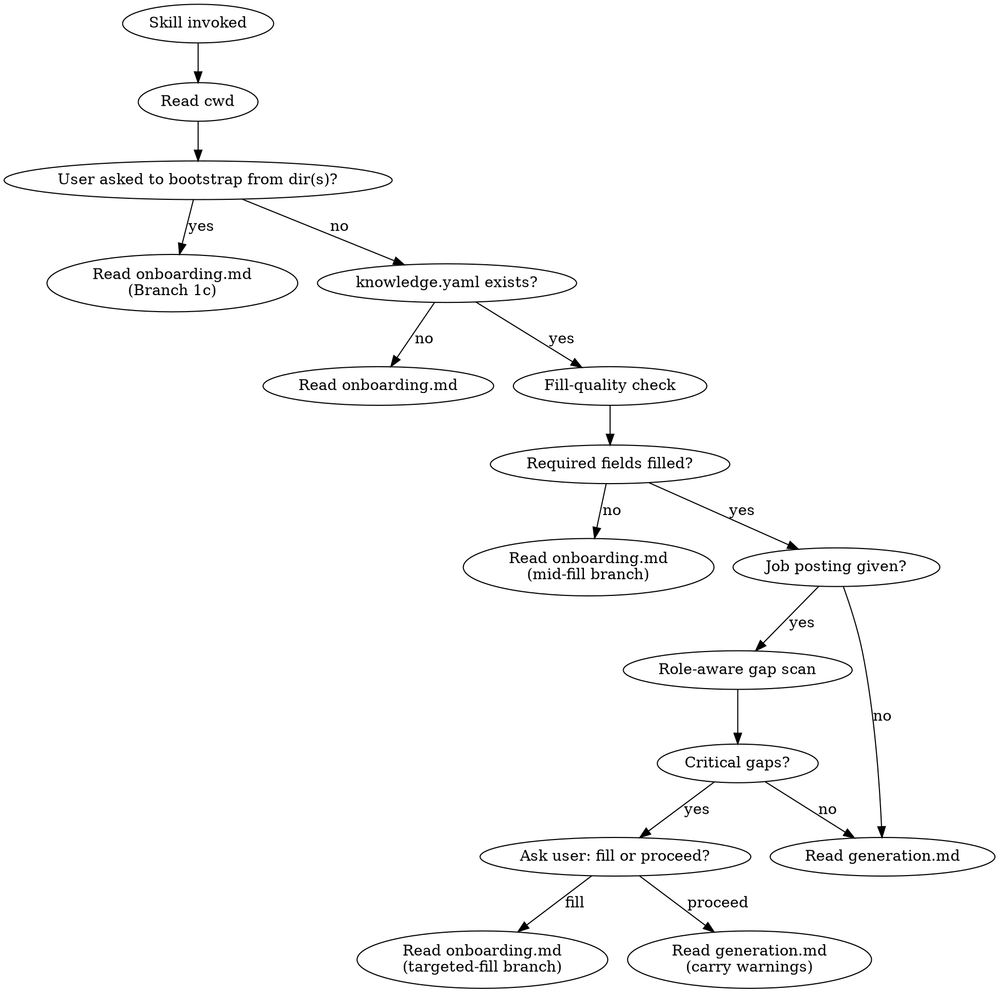

# Resume Generator

## Overview

Standalone skill that generates tailored LaTeX resumes (and PDFs) from a `knowledge.yaml` file in the user's current working directory. All templates, the blank knowledge template, and the procedural sub-docs live inside the skill folder — no repo coupling, works in any directory.

`<SKILL_ROOT>` below = the directory containing this file (resolve at runtime — exact path depends on where the host CLI installs skills).
`<cwd>` = the user's current working directory (where the resume will be generated).

## Bundled assets

```
<SKILL_ROOT>/
├── SKILL.md                          # this file (entry, gate, dispatch)
├── onboarding.md                     # loaded when knowledge.yaml is missing or mid-fill
├── generation.md                     # loaded when knowledge.yaml passes the gate
├── assets/
│   └── knowledge.template.yaml       # blank template with <PLACEHOLDER> sentinels
├── templates/                        # all six LaTeX templates, source-only
│   ├── 1/  res.cls + template.tex                                      # Classic Academic CV   (pdflatex)
│   ├── 2/  resume.cls + template.tex                                   # Modern Professional   (pdflatex, default)
│   ├── 3/  FreemanCV.cls + Fonts/ + template.tex                       # Freeman CV            (xelatex)
│   ├── 4/  moderncv.cls + *.sty + pictures/ + template.tex             # ModernCV              (pdflatex)
│   ├── 5/  structure.tex + fonts/ + template.tex                       # Wilson Resume         (xelatex)
│   └── 6/  structure.tex + template.tex                                # Cies Resume           (pdflatex)
├── tests/
│   ├── compile-all.sh                # sanity check that every template compiles
│   └── preflight.sh                  # cross-OS LaTeX env check + auto-installer (used by generation.md Step 1.5)
└── docs/
    └── *.md                          # design notes (read-only history)
```

## Entry workflow + gate



### Step 1 — read cwd, look for `knowledge.yaml`

If absent → **Read `<SKILL_ROOT>/onboarding.md` and follow it.** Do not proceed.

The user may also explicitly ask to bootstrap from a directory (or directories) of their work — phrases like "build a knowledge.yaml from `~/work/projects`" or "go through this folder and draft my entries". When this happens (whether `knowledge.yaml` exists yet or not), route to onboarding **Branch 1c** which dispatches a sub-agent per directory to walk the contents, draft `projects[]` / `experience[]` entries, and record `evidence:` pointers for future deep-dives.

### Step 2 — fill-quality check (hard gate)

Read `<cwd>/knowledge.yaml`. Required fields must be present, non-empty, and free of `<PLACEHOLDER>` sentinels (regex: `<[A-Z_]+>`):

- `name`
- `email`
- at least one entry in `education`
- at least one entry in **either** `experience` or `projects`

If any required field fails → **Read `<SKILL_ROOT>/onboarding.md` and follow it (mid-fill branch).** Do not proceed.

### Step 3 — job posting → role-aware soft gate

If the user provided a job posting:

- **Pasted text** → analyse it inline. The text is already in your context; dispatching a sub-agent would re-emit those tokens.
- **URL or file path** → dispatch a sub-agent to fetch + analyse, isolating raw content from main:
  - `subagent_type`: `general-purpose`
  - `model`: `haiku`
  - `description`: `Analyse job posting`
  - `prompt`: include the URL or file path; ask the agent to use `WebFetch` (URL) or `Read` (file) to retrieve the source, then return only: required skills, preferred qualifications, job title, company, domain, role classification (academic/industry/creative/european/detailed/minimal) with confidence (low/med/high).

Cross-check the analysis against `knowledge.yaml`:
- Are the posting's required skills covered in `skills.*`?
- Are relevant project entries present?
- Is the profile aligned with the role's domain?

If gaps exist:
- Tell the user which optional fields are weak for this role.
- Offer two choices: **Fill** (route to onboarding Branch 3) or **Proceed without** (warn that recruiter screening will see the gaps).
- Carry the user's choice + the gap list forward into `generation.md`.

### Step 4 — dispatch to generation

When the gate is fully clear → **Read `<SKILL_ROOT>/generation.md` and follow it.** Pass forward: the yaml content, the job-posting analysis (if any), the user's template choice (if explicit), any soft-warning gap list.

## Critical rules

- This skill is standalone. Never read or write files in any project repo unless the user's `cwd` is that repo, OR the path appears under a `evidence:` field in `knowledge.yaml` (those are explicit user-granted read pointers).
- The skill folder is read-only from the user's perspective. Outputs go to `<cwd>/outputs/<role-slug>/`, never inside `<SKILL_ROOT>`.
- Never start LaTeX generation while the gate is failing — control must return through the gate.
- Sub-agents are dispatched only when they fetch content not yet in main context (URL, file path, large `.log`, dir walks for bootstrap or deep-dive). For pasted text or content the main agent already holds, work inline to avoid wasting tokens on re-emission.
- All sub-agents use built-in types only (`general-purpose`, `Explore`). No plugin agent dependencies.
- `evidence:` entries are READ-ONLY pointers. Deep-dive sub-agents may read them; nothing in this skill ever writes to those locations.

## Common mistakes

| Mistake | Fix |
|---|---|
| Reading `knowledge.yaml` from skill folder | Always read from `<cwd>`, never from `<SKILL_ROOT>` |
| Generating into the skill folder | Outputs always go to `<cwd>/outputs/<slug>/` |
| Skipping the gate "because the user is in a hurry" | Gate failures cause broken resumes — onboarding first, always |
| Dispatching a sub-agent to analyse pasted-text job posting | Wastes tokens — main already has the text, analyse inline |
| Re-fetching a job posting URL once during the gate and again during generation | Reuse the gate-time analysis |
