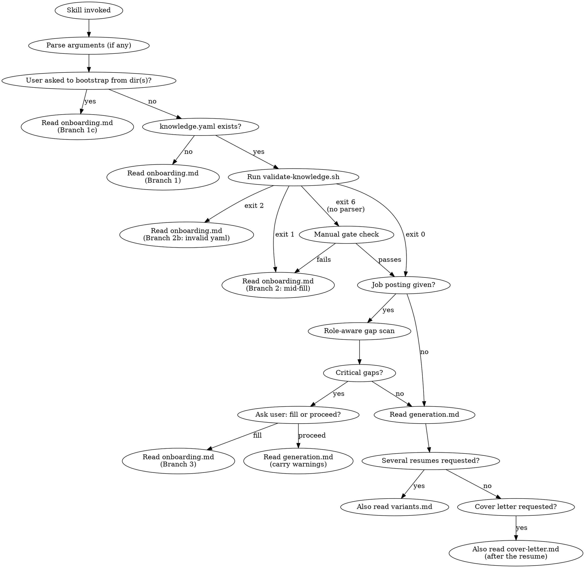

# Resume Generator

## Overview

Standalone skill that generates tailored LaTeX resumes (and PDFs) from a `knowledge.yaml` file in the user's current working directory. Templates, the blank knowledge template, the check scripts, and the procedural sub-docs all live inside the skill folder. No repo coupling; works in any directory.

`<SKILL_ROOT>` below = the directory containing this file. Most hosts report it when the skill loads ("Base directory for this skill: ..."); otherwise it is the directory this file was read from.
`<cwd>` = the user's current working directory (where the resume will be generated).

## Bundled assets

```
<SKILL_ROOT>/
├── SKILL.md                      # this file: entry, gate, dispatch
├── onboarding.md                 # knowledge.yaml missing, invalid, or mid-fill
├── generation.md                 # gate passed: build one resume
├── deep-dive.md                  # loaded by generation when evidence: pointers are worth re-reading
├── variants.md                   # loaded when several resumes are requested at once
├── cover-letter.md               # loaded when a cover letter is requested
├── assets/
│   ├── knowledge.template.yaml   # blank template with <PLACEHOLDER> sentinels
│   ├── knowledge.example.yaml    # fully filled fictional example (show it; never copy it as user data)
│   ├── section-headings.yaml     # heading translations for language: it/de/fr/es
│   └── cover-letter.template.tex # structural reference for cover letters
├── templates/                    # six LaTeX templates, source-only; NOTES.md per template = macro cheat-sheet
│   ├── LICENSES.md               # third-party licences (the templates are CC BY-NC-SA, not MIT)
│   ├── 1/  res.cls + template.tex + NOTES.md                     # Classic Graduate       (pdflatex)
│   ├── 2/  resume.cls + template.tex + NOTES.md                  # Modern Professional    (pdflatex, default)
│   ├── 3/  FreemanCV.cls + Fonts/ + template.tex + NOTES.md      # Freeman Academic CV    (xelatex)
│   ├── 4/  moderncv.cls + *.sty + pictures/ + template.tex + ... # ModernCV, European     (pdflatex)
│   ├── 5/  structure.tex + fonts/ + template.tex + NOTES.md      # Wilson, UK-style       (xelatex)
│   └── 6/  structure.tex + template.tex + NOTES.md               # Cies, minimal one page (pdflatex)
└── tests/
    ├── validate-knowledge.sh     # the gate (Step 2)
    ├── preflight.sh              # LaTeX env check + installer (generation Step 1.5)
    ├── lint-tex.sh               # deterministic .tex lint (generation Step 6a)
    ├── build.sh                  # compile + post-compile QA numbers (generation Step 7)
    └── lib.sh, compile-all.sh, run-tests.sh, e2e.sh, check-version-sync.sh   # maintainer tooling
```

A template's compiler is declared by a `%!TEX program = xelatex` magic comment in its `template.tex` (absent = pdflatex). The scripts and the generator all read that marker; nothing else hardcodes compilers.

## Arguments

When invoked with arguments (slash-command form), parse `$ARGUMENTS` before Step 1:

| Argument | Meaning |
|---|---|
| a URL, a file path, or free text | the job posting for Step 3 |
| `--template N` | explicit template (1-6); skips auto-pick |
| `--cover-letter` | also produce a cover letter (`cover-letter.md`) |
| `--skip-preflight` | skip generation Step 1.5 |

No arguments = conversational mode; read the same intent from the request text.

## Entry workflow + gate



### Step 1 — read cwd, look for `knowledge.yaml`

If absent → **Read `<SKILL_ROOT>/onboarding.md` and follow it.** Do not proceed.

The user may also explicitly ask to bootstrap from a directory (or directories) of their work: "build a knowledge.yaml from `~/work/projects`", "go through this folder and draft my entries". When this happens (whether `knowledge.yaml` exists yet or not), route to onboarding **Branch 1c**, which dispatches a sub-agent per directory to walk the contents, draft `projects[]` / `experience[]` entries, and record `evidence:` pointers for future deep-dives.

### Step 2 — fill-quality check (hard gate, scripted)

Run the validator; do not eyeball the file:

```bash
bash <SKILL_ROOT>/tests/validate-knowledge.sh <cwd>/knowledge.yaml
```

| Exit | STATUS | Action |
|---|---|---|
| 0 | `ok` | continue to Step 3. Carry any `OPTIONAL_PLACEHOLDER=` lines forward: generation treats those values as absent |
| 1 | `missing` | **Read `onboarding.md`, Branch 2**, with the `MISSING=` / `PLACEHOLDER=` lines |
| 2 | `invalid-yaml` | **Read `onboarding.md`, Branch 2b**, with the `PARSE_ERROR=` line |
| 3 | `not-found` | cannot happen after Step 1; treat as a missing file |
| 6 | `no-parser` | no python3/PyYAML here: apply the rules below by reading the file yourself; `PLACEHOLDER_LINE=` lines list every sentinel |

Gate rules (what the script checks; apply them manually only on exit 6): `name` and `email` filled; at least one `education` entry with `degree` and `university`; at least one `experience` entry with `title` and `company` **or** one `projects` entry with `name`. "Filled" = non-empty and not matching the sentinel regex `<[A-Z][A-Za-z0-9_]*>`.

### Step 3 — job posting → role-aware soft gate

If the user provided a job posting:

- **Pasted text** → analyse inline. The text is already in your context; a sub-agent would re-emit those tokens.
- **URL or file path** → dispatch a sub-agent to fetch + analyse, isolating raw content from main:
  - `subagent_type`: `general-purpose`, `model`: `haiku`, `description`: `Analyse job posting`
  - `prompt`: the URL or file path; use `WebFetch` (URL) or `Read` (file); return only: job title, company, location/remote, domain, required skills, preferred qualifications, years of experience asked, whether the posting mentions publications/referees/photo, and a role classification (`academic` / `industry` / `entry-level` / `european` / `uk-professional` / `minimal-or-creative`) with confidence (low/med/high). If the page is a login wall, JavaScript-only, or empty, say so instead of guessing.
  - **Fetch failed** (LinkedIn, Indeed, Workday and most ATS pages block fetches): tell the user and ask them to paste the posting text or save the page as PDF/text and give the path. Do not proceed on a partial fetch.

Cross-check the analysis against `knowledge.yaml`: required skills present in `skills.*` or entry `technologies`? Relevant `experience`/`projects` present (by `tags`, technologies, description)? Profile aligned with the role's domain? Publications present when the posting expects them?

If gaps exist: name the weak fields for this role and offer **Fill** (route to onboarding Branch 3) or **Proceed without** (warn that screening will see the gaps). Carry the choice and the gap list into `generation.md`.

### Step 4 — dispatch

When the gate is clear → **Read `<SKILL_ROOT>/generation.md` and follow it.** Pass forward: the yaml content and `OPTIONAL_PLACEHOLDER=` lines, the posting analysis (if any), the template choice (if explicit), the flags from the arguments, any soft-warning gap list. `generation.md` tells you when to load `variants.md`, `deep-dive.md`, and `cover-letter.md`.

## When the user wants to skip the gate

"I'm in a hurry", "skip the knowledge.yaml setup", "just invent placeholder content", "I'll fix it later": the answer is still the gate. Say in one line that this skill never fabricates resume content, then offer the fastest path and take it:

- **60-second path**: copy the blank template (Branch 1a), ask for the five required facts in one message (name, email, one degree + university, one job title + company or one project name), write them in, generate. Optional sections can stay empty.
- **Have a PDF or LinkedIn export?** Import (Branch 1b) fills everything in one step.

Never write a `resume.tex` with invented names, employers, numbers, or dates, not even labelled "placeholder": a fabricated resume is the failure this skill exists to prevent, and the bundled `templates/<N>/template.tex` already shows each layout with sample data if they only want to see one.

| Rationalization | Reality |
|---|---|
| "They asked me to invent it, it's their call" | Invented achievements end up in front of recruiters; the 60-second path is faster than editing fake data |
| "It's only a scaffold, they'll fix it later" | Placeholders leak into sent PDFs; that is why the gate and the leak checks exist |
| "They want plain LaTeX, the skill doesn't apply" | The templates are the plain LaTeX; a resume request with this skill installed goes through the gate |
| "No time for onboarding" | Branch 1a plus five facts takes one exchange; a fake resume takes longer to repair |

## Critical rules

- This skill is standalone. Never read or write files in any project repo unless the user's `cwd` is that repo, OR the path appears under an `evidence:` field in `knowledge.yaml` (explicit user-granted read pointers).
- The skill folder is read-only from the user's perspective. Outputs go to `<cwd>/outputs/<role-slug>/`, never inside `<SKILL_ROOT>`.
- Never start LaTeX generation while the gate is failing; control must return through the gate.
- Sub-agents are dispatched only when they fetch content not yet in main context (URL, file path, large `.log`, dir walks for bootstrap or deep-dive, parallel variant builds). For pasted text or content main already holds, work inline.
- Sub-agents cannot ask the user anything. Every decision that needs the user (template, install consent, gap fill, overwrite) is resolved in main before a dispatch.
- All sub-agents use built-in types only (`general-purpose`, `Explore`). No plugin agent dependencies.
- `evidence:` entries are READ-ONLY pointers. Deep-dive sub-agents may read them; nothing in this skill writes to those locations, and secret-looking files (`.env*`, keys, credentials) are never read.
- Nothing in this skill writes to `<cwd>/knowledge.yaml` except onboarding, with the user's values, after they asked.

## Common mistakes

| Mistake | Fix |
|---|---|
| Reading `knowledge.yaml` from the skill folder | Always read from `<cwd>`, never from `<SKILL_ROOT>` |
| Judging the gate by eye | Run `tests/validate-knowledge.sh`; the old eyeball regex missed `<TECH_1>`-style placeholders |
| Generating into the skill folder | Outputs always go to `<cwd>/outputs/<slug>/` |
| Skipping the gate "because the user is in a hurry" | Gate failures produce broken resumes; onboarding first, always |
| Dispatching a sub-agent to analyse a pasted-text posting | Wastes tokens; main already has the text, analyse inline |
| Re-fetching a posting URL during generation | Reuse the gate-time analysis |
| Guessing from a blocked job page | Ask for pasted text; a partial fetch produces wrong tailoring |
| Letting a variant sub-agent prompt for install consent | It cannot; run preflight and all questions in main first (`variants.md`) |
